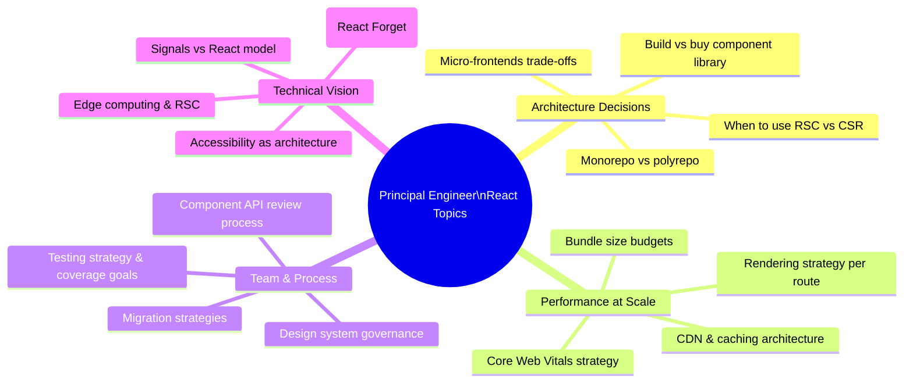
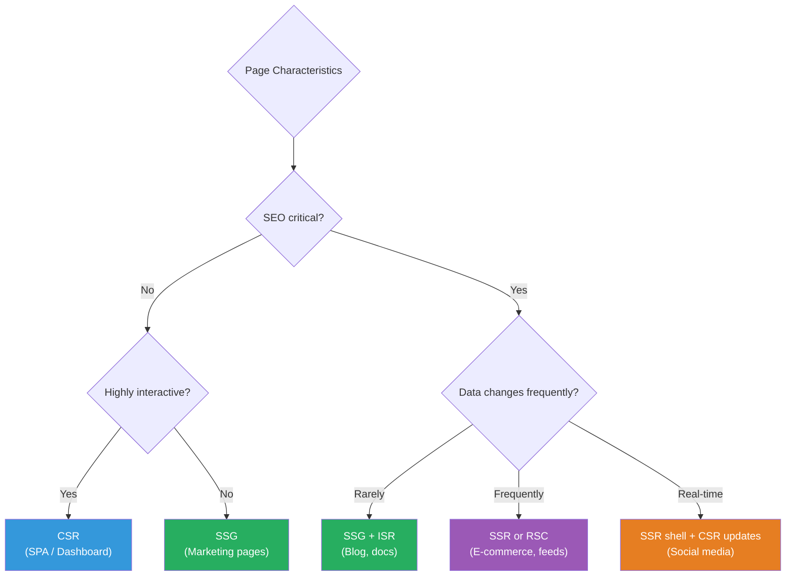
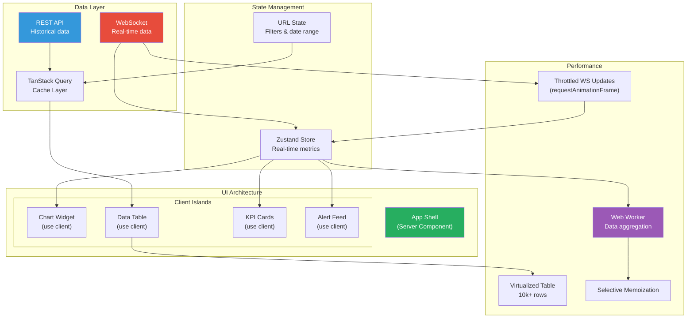

# 1. Interview Scenarios & Talking Points

## 1.1 Principal-Level Discussion Topics

## 1.2 Key Questions & How to Answer

### "How do you decide between CSR, SSR, SSG, and RSC?"

### "Walk me through a performance issue you've solved"

**Framework answer:**
1. **Identify**: How was it measured? (Core Web Vitals, Lighthouse, user reports)
2. **Diagnose**: What tools did you use? (React Profiler, Chrome DevTools, bundle analyzer)
3. **Root cause**: What specifically was wrong? (unnecessary re-renders, large bundle, slow API)
4. **Solution**: What did you implement? (code splitting, virtualization, memoization, caching)
5. **Validation**: How did you confirm improvement? (before/after metrics)
6. **Prevention**: What process did you put in place? (performance budgets, CI checks)

### "How would you migrate a large class component codebase to hooks?"

**Answer framework:**
1. **Don't rewrite** — migrate incrementally as you touch components
2. **Start with leaf components** (no children depending on their internals)
3. **Extract logic into custom hooks** first, class wrapper can remain
4. **Establish patterns** — create example migrations as reference
5. **Automated codemods** for simple patterns (e.g., `react-codemod`)
6. **Test before and after** — behavior should be identical
7. **Set timeline boundaries** — don't let migration drag indefinitely

### "How do you architect a component library / design system?"

**Key talking points:**
- **Token-driven**: All visual decisions flow from tokens (colors, spacing, typography)
- **Composable over configurable**: Prefer children/slots over mega-prop APIs
- **Headless separation**: Logic hooks (useCombobox) separate from styled components
- **Accessibility first**: ARIA patterns baked into base components
- **Versioning & governance**: Semver, changelogs, deprecation process
- **Documentation**: Storybook with interactive examples and usage guidelines
- **Testing**: Visual regression (Chromatic), unit tests, a11y audits

## 1.3 System Design Exercise: Build a Real-Time Dashboard

**Key discussion points:**
- **WebSocket management**: Reconnection, backpressure, throttling updates
- **Rendering performance**: RAF batching, virtualization, memoization
- **Data aggregation**: Web Workers for heavy computation off main thread
- **Error resilience**: Error boundaries per widget, graceful degradation
- **Accessibility**: Live regions for alerts, keyboard navigation for tables

---
