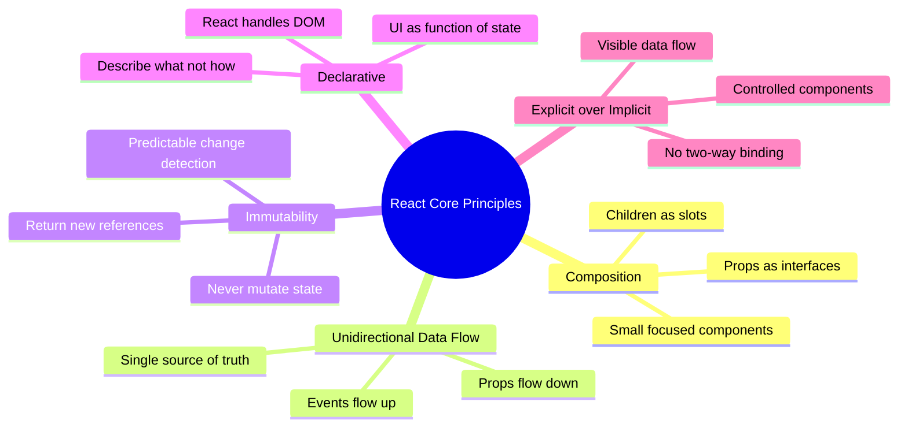

# 1. React Mental Model & Core Philosophy

## 1.1 The Declarative Paradigm

React's core idea: **UI is a function of state.**

```
UI = f(state)
```

You describe *what* the UI should look like for a given state, not *how* to transition between DOM states. React handles the imperative DOM manipulation.

```jsx
// Imperative (vanilla JS)
function updateCounter(count) {
  const el = document.getElementById('counter');
  el.textContent = count;
  if (count > 10) {
    el.classList.add('warning');
  } else {
    el.classList.remove('warning');
  }
}

// Declarative (React)
function Counter({ count }) {
  return (
    <span className={count > 10 ? 'warning' : ''}>
      {count}
    </span>
  );
}
```

## 1.2 Core Principles



## 1.3 Virtual DOM — Accurate Mental Model

> **Principal-level insight:** The "Virtual DOM is fast" narrative is misleading. The VDOM is a *programming model* trade-off — it lets you write declarative code with acceptable performance. Direct DOM manipulation is always faster *if done perfectly*. The VDOM is a batching and diffing layer that makes declarative rendering practical.


A React element is just a lightweight JS object:

```jsx
// JSX
<button className="primary" onClick={handleClick}>
  Save
</button>

// Compiles to (conceptually)
{
  type: 'button',
  props: {
    className: 'primary',
    onClick: handleClick,
    children: 'Save'
  }
}
```

---
