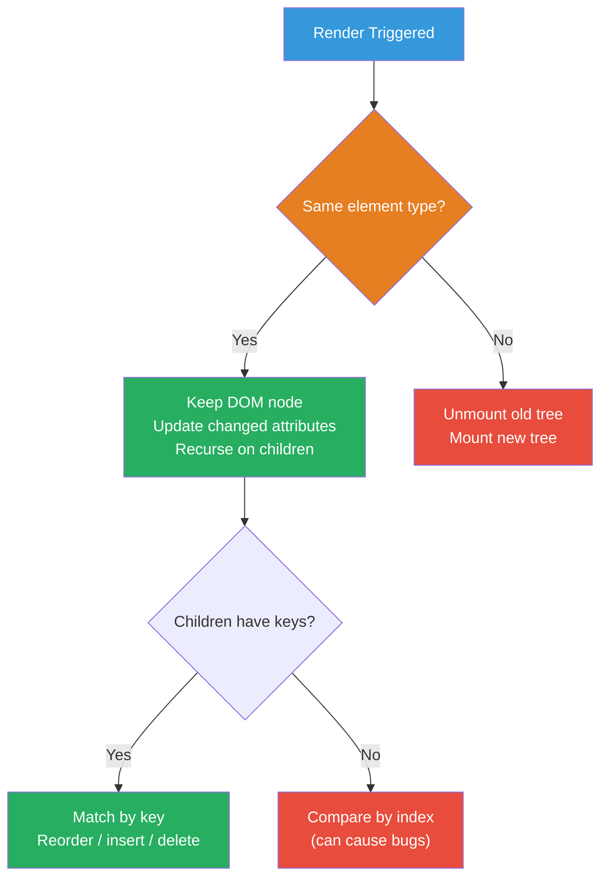
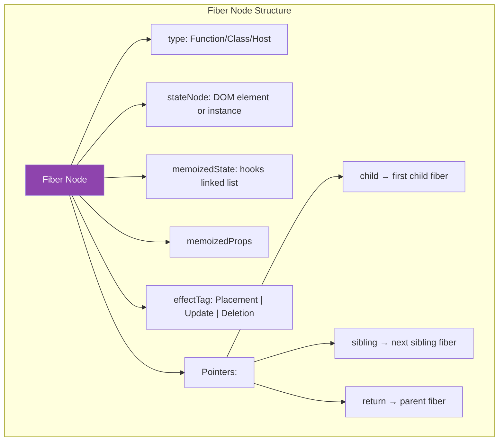
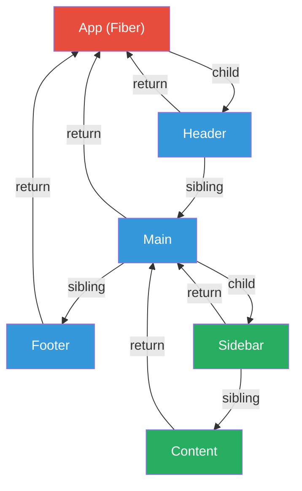
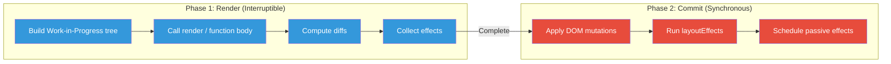

# 1. Reconciliation & Fiber Architecture

## 1.1 The Reconciliation Algorithm

React uses **heuristic O(n) diffing** instead of the theoretical O(n³) tree diff:

**Two key assumptions:**
1. Elements of **different types** produce different trees → tear down old, build new
2. Developer provides **`key`** props to hint which children are stable across renders

## 1.2 Fiber Architecture (React 16+)

Fiber is React's **reimplemented reconciler** that enables:
- **Incremental rendering** — split work into chunks
- **Prioritization** — some updates are more urgent
- **Concurrency** — pause, abort, or reuse work

### Fiber Tree Traversal

React traverses this as a **linked list** (not recursion), enabling pausing mid-tree.

## 1.3 Two-Phase Rendering

> **Principal-level insight:** The render phase must be **pure** (no side effects). It can be called multiple times, skipped, or restarted. Side effects belong in the commit phase (effects, refs).

---
