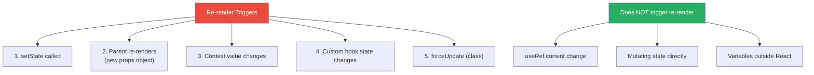
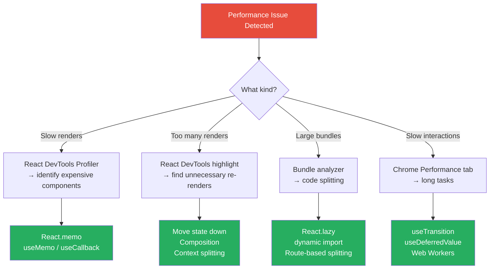

# 1. Rendering Pipeline & Performance

## 1.1 What Triggers a Re-render?



> **Critical misconception:** A parent re-render **always** re-renders children *unless* they are memoized with `React.memo`. Props don't need to change — the child re-renders because React calls the parent function, which calls `createElement` for children, creating new element objects.

## 1.2 React.memo Deep Dive

```jsx
// Basic memo
const ExpensiveList = React.memo(function ExpensiveList({ items, onSelect }) {
  return items.map(item => (
    <div key={item.id} onClick={() => onSelect(item.id)}>
      {item.name}
    </div>
  ));
});

// Custom comparison
const Chart = React.memo(
  function Chart({ data, config }) {
    // expensive rendering
  },
  (prevProps, nextProps) => {
    // Return true to SKIP re-render (opposite of shouldComponentUpdate)
    return (
      prevProps.data.length === nextProps.data.length &&
      prevProps.config.theme === nextProps.config.theme
    );
  }
);

// ⚠️ Common mistake: memo is useless if props change every render
function Parent() {
  // ❌ New object every render — memo won't help
  return <Child style={{ color: 'red' }} onClick={() => doSomething()} />;

  // ✅ Stable references
  const style = useMemo(() => ({ color: 'red' }), []);
  const handleClick = useCallback(() => doSomething(), []);
  return <Child style={style} onClick={handleClick} />;
}
```

## 1.3 Composition as Performance Optimization

```jsx
// ❌ BAD: SlowComponent re-renders on every mouse move
function App() {
  const [position, setPosition] = useState({ x: 0, y: 0 });

  return (
    <div onMouseMove={(e) => setPosition({ x: e.clientX, y: e.clientY })}>
      <Cursor position={position} />
      <SlowComponent /> {/* Re-renders every mouse move! */}
    </div>
  );
}

// ✅ GOOD: Move state down — SlowComponent is unaffected
function App() {
  return (
    <div>
      <MouseTracker />      {/* Has its own state */}
      <SlowComponent />     {/* Never re-renders from mouse movement */}
    </div>
  );
}

function MouseTracker() {
  const [position, setPosition] = useState({ x: 0, y: 0 });
  return (
    <div onMouseMove={(e) => setPosition({ x: e.clientX, y: e.clientY })}>
      <Cursor position={position} />
    </div>
  );
}

// ✅ ALSO GOOD: Pass children (they're already created elements)
function MouseArea({ children }) {
  const [position, setPosition] = useState({ x: 0, y: 0 });
  return (
    <div onMouseMove={(e) => setPosition({ x: e.clientX, y: e.clientY })}>
      <Cursor position={position} />
      {children} {/* Already a React element — not re-created */}
    </div>
  );
}

// Usage
<MouseArea>
  <SlowComponent /> {/* Not re-rendered! */}
</MouseArea>
```

## 1.4 Virtualization

```jsx
import { useVirtualizer } from '@tanstack/react-virtual';

function VirtualList({ items }) {
  const parentRef = useRef(null);

  const virtualizer = useVirtualizer({
    count: items.length,
    getScrollElement: () => parentRef.current,
    estimateSize: () => 50, // estimated row height
    overscan: 5,            // extra items rendered outside viewport
  });

  return (
    <div ref={parentRef} style={{ height: '500px', overflow: 'auto' }}>
      <div
        style={{
          height: `${virtualizer.getTotalSize()}px`,
          position: 'relative',
        }}
      >
        {virtualizer.getVirtualItems().map((virtualRow) => (
          <div
            key={virtualRow.key}
            style={{
              position: 'absolute',
              top: 0,
              left: 0,
              width: '100%',
              height: `${virtualRow.size}px`,
              transform: `translateY(${virtualRow.start}px)`,
            }}
          >
            {items[virtualRow.index].name}
          </div>
        ))}
      </div>
    </div>
  );
}
```

## 1.5 Performance Toolkit



---
