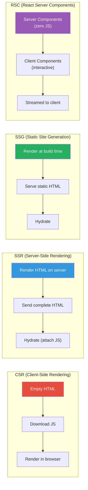
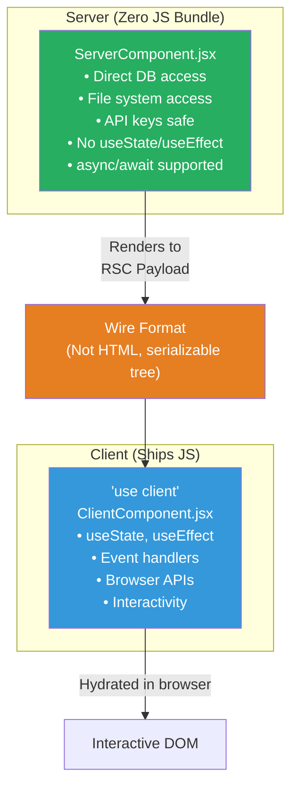
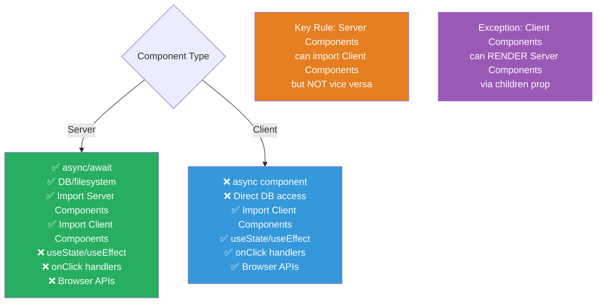

# 1. Server Components & SSR

## 1.1 Rendering Strategies



## 1.2 React Server Components (RSC)



```jsx
// Server Component (default in Next.js App Router)
// No 'use client' directive needed
async function UserProfile({ userId }) {
  // Direct database access — no API route needed
  const user = await db.user.findUnique({ where: { id: userId } });
  const posts = await db.post.findMany({ where: { authorId: userId } });

  return (
    <div>
      <h1>{user.name}</h1>
      <p>{user.bio}</p>
      {/* Client component for interactivity */}
      <LikeButton initialCount={user.likes} userId={userId} />
      {/* Server-rendered list */}
      {posts.map(post => (
        <PostCard key={post.id} post={post} />
      ))}
    </div>
  );
}

// Client Component
'use client';

import { useState } from 'react';

function LikeButton({ initialCount, userId }) {
  const [count, setCount] = useState(initialCount);
  const [isPending, setIsPending] = useState(false);

  async function handleLike() {
    setIsPending(true);
    setCount(c => c + 1); // Optimistic
    await fetch(`/api/users/${userId}/like`, { method: 'POST' });
    setIsPending(false);
  }

  return (
    <button onClick={handleLike} disabled={isPending}>
      ❤️ {count}
    </button>
  );
}
```

### RSC Rules



---
