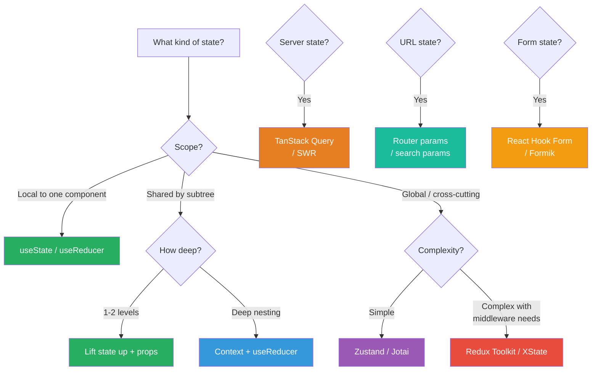
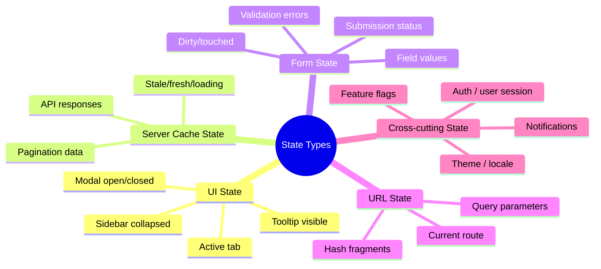

# 1. State Management Strategies

## 1.1 Decision Framework



## 1.2 State Categories



## 1.3 Context — Proper Usage

```jsx
// ✅ GOOD: Separate contexts for different update frequencies
const ThemeContext = createContext();
const AuthContext = createContext();
const LocaleContext = createContext();

// ✅ GOOD: Split value and dispatch to avoid unnecessary re-renders
const StateContext = createContext();
const DispatchContext = createContext();

function AppProvider({ children }) {
  const [state, dispatch] = useReducer(appReducer, initialState);

  // Memoize the state value to prevent object identity changes
  const stateValue = useMemo(() => state, [state]);

  // dispatch is already stable from useReducer
  return (
    <DispatchContext.Provider value={dispatch}>
      <StateContext.Provider value={stateValue}>
        {children}
      </StateContext.Provider>
    </DispatchContext.Provider>
  );
}

// Custom hooks for consuming
function useAppState() {
  const context = useContext(StateContext);
  if (context === undefined) {
    throw new Error('useAppState must be used within AppProvider');
  }
  return context;
}

function useAppDispatch() {
  const context = useContext(DispatchContext);
  if (context === undefined) {
    throw new Error('useAppDispatch must be used within AppProvider');
  }
  return context;
}
```

> **Principal-level insight:** Context is NOT a state management solution — it's a *dependency injection* mechanism. It doesn't optimize re-renders; every consumer re-renders when the provider value changes. For frequent updates, use dedicated state management libraries or split contexts granularly.

## 1.4 Zustand (Modern, Lightweight)

```jsx
import { create } from 'zustand';
import { devtools, persist, immer } from 'zustand/middleware';

const useStore = create(
  devtools(
    persist(
      immer((set, get) => ({
        // State
        todos: [],
        filter: 'all',

        // Actions
        addTodo: (text) =>
          set((state) => {
            state.todos.push({
              id: crypto.randomUUID(),
              text,
              completed: false,
            });
          }),

        toggleTodo: (id) =>
          set((state) => {
            const todo = state.todos.find((t) => t.id === id);
            if (todo) todo.completed = !todo.completed;
          }),

        // Derived (computed in selector, not stored)
        // Use selectors at consumption point
      })),
      { name: 'todo-storage' }
    )
  )
);

// Usage with selectors (prevents unnecessary re-renders)
function TodoCount() {
  const count = useStore((state) => state.todos.length);
  return <span>{count} todos</span>;
}

function TodoList() {
  const todos = useStore((state) => {
    const filter = state.filter;
    return filter === 'all'
      ? state.todos
      : state.todos.filter((t) =>
          filter === 'completed' ? t.completed : !t.completed
        );
  });
  // ...
}
```

## 1.5 TanStack Query (Server State)

```jsx
import { useQuery, useMutation, useQueryClient } from '@tanstack/react-query';

function useUsers() {
  return useQuery({
    queryKey: ['users'],
    queryFn: () => fetch('/api/users').then(res => res.json()),
    staleTime: 5 * 60 * 1000,     // Data fresh for 5 minutes
    gcTime: 30 * 60 * 1000,       // Cache kept for 30 minutes
    retry: 3,
    refetchOnWindowFocus: true,
  });
}

function useCreateUser() {
  const queryClient = useQueryClient();

  return useMutation({
    mutationFn: (newUser) =>
      fetch('/api/users', {
        method: 'POST',
        body: JSON.stringify(newUser),
      }).then(res => res.json()),

    // Optimistic update
    onMutate: async (newUser) => {
      await queryClient.cancelQueries({ queryKey: ['users'] });
      const previous = queryClient.getQueryData(['users']);
      queryClient.setQueryData(['users'], (old) => [
        ...old,
        { ...newUser, id: 'temp-id' },
      ]);
      return { previous };
    },
    onError: (err, newUser, context) => {
      queryClient.setQueryData(['users'], context.previous);
    },
    onSettled: () => {
      queryClient.invalidateQueries({ queryKey: ['users'] });
    },
  });
}

// Usage
function UserList() {
  const { data: users, isLoading, error } = useUsers();
  const createUser = useCreateUser();

  if (isLoading) return <Skeleton />;
  if (error) return <ErrorDisplay error={error} />;

  return (
    <>
      {users.map(user => <UserCard key={user.id} user={user} />)}
      <button
        onClick={() => createUser.mutate({ name: 'New User' })}
        disabled={createUser.isPending}
      >
        Add User
      </button>
    </>
  );
}
```

---
