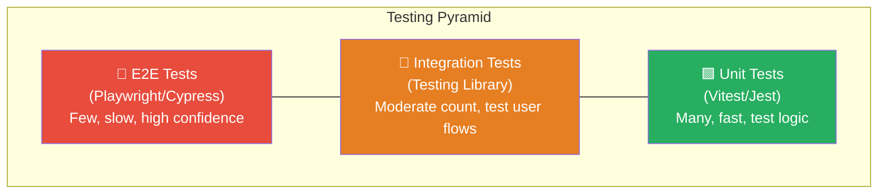

# 1. Testing Strategy

## 1.1 Testing Pyramid for React



## 1.2 Testing Library Philosophy

> Test behavior, not implementation. Tests should resemble how users interact with your app.

```jsx
import { render, screen, waitFor } from '@testing-library/react';
import userEvent from '@testing-library/user-event';

// Component under test
function LoginForm({ onSubmit }) {
  const [error, setError] = useState('');

  async function handleSubmit(e) {
    e.preventDefault();
    const formData = new FormData(e.target);
    const email = formData.get('email');
    const password = formData.get('password');

    if (!email || !password) {
      setError('All fields are required');
      return;
    }

    await onSubmit({ email, password });
  }

  return (
    <form onSubmit={handleSubmit}>
      <label htmlFor="email">Email</label>
      <input id="email" name="email" type="email" />

      <label htmlFor="password">Password</label>
      <input id="password" name="password" type="password" />

      {error && <p role="alert">{error}</p>}

      <button type="submit">Sign In</button>
    </form>
  );
}

// Tests
describe('LoginForm', () => {
  it('shows validation error when fields are empty', async () => {
    const user = userEvent.setup();
    render(<LoginForm onSubmit={vi.fn()} />);

    await user.click(screen.getByRole('button', { name: /sign in/i }));

    expect(screen.getByRole('alert')).toHaveTextContent('All fields are required');
  });

  it('submits the form with valid data', async () => {
    const user = userEvent.setup();
    const mockSubmit = vi.fn();
    render(<LoginForm onSubmit={mockSubmit} />);

    await user.type(screen.getByLabelText(/email/i), 'test@example.com');
    await user.type(screen.getByLabelText(/password/i), 'password123');
    await user.click(screen.getByRole('button', { name: /sign in/i }));

    expect(mockSubmit).toHaveBeenCalledWith({
      email: 'test@example.com',
      password: 'password123',
    });
  });
});
```

## 1.3 Testing Custom Hooks

```jsx
import { renderHook, act } from '@testing-library/react';

function useCounter(initialValue = 0) {
  const [count, setCount] = useState(initialValue);
  const increment = () => setCount(c => c + 1);
  const decrement = () => setCount(c => c - 1);
  const reset = () => setCount(initialValue);
  return { count, increment, decrement, reset };
}

describe('useCounter', () => {
  it('starts with initial value', () => {
    const { result } = renderHook(() => useCounter(10));
    expect(result.current.count).toBe(10);
  });

  it('increments', () => {
    const { result } = renderHook(() => useCounter(0));
    act(() => { result.current.increment(); });
    expect(result.current.count).toBe(1);
  });

  it('resets to initial value', () => {
    const { result } = renderHook(() => useCounter(5));
    act(() => { result.current.increment(); });
    act(() => { result.current.reset(); });
    expect(result.current.count).toBe(5);
  });
});
```

## 1.4 Testing with Providers

```jsx
function renderWithProviders(ui, { preloadedState = {}, ...options } = {}) {
  const queryClient = new QueryClient({
    defaultOptions: {
      queries: { retry: false },
      mutations: { retry: false },
    },
  });

  function Wrapper({ children }) {
    return (
      <QueryClientProvider client={queryClient}>
        <ThemeProvider theme="light">
          <MemoryRouter>
            {children}
          </MemoryRouter>
        </ThemeProvider>
      </QueryClientProvider>
    );
  }

  return render(ui, { wrapper: Wrapper, ...options });
}

// Usage
it('renders user dashboard', async () => {
  server.use(
    rest.get('/api/users/me', (req, res, ctx) =>
      res(ctx.json({ name: 'John', role: 'admin' }))
    )
  );

  renderWithProviders(<Dashboard />);

  expect(await screen.findByText('Welcome, John')).toBeInTheDocument();
});
```

---
