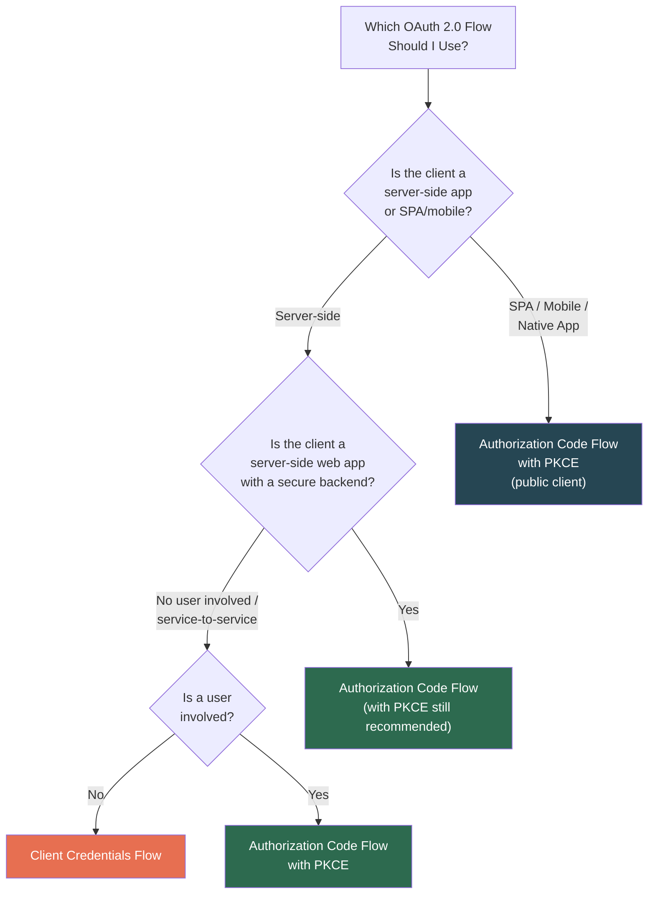
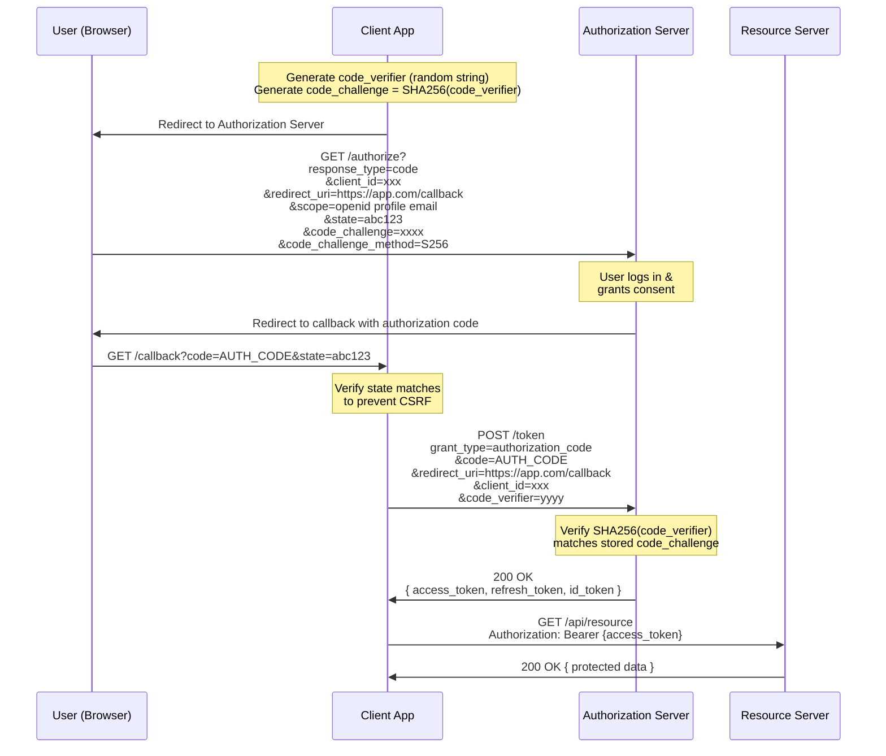
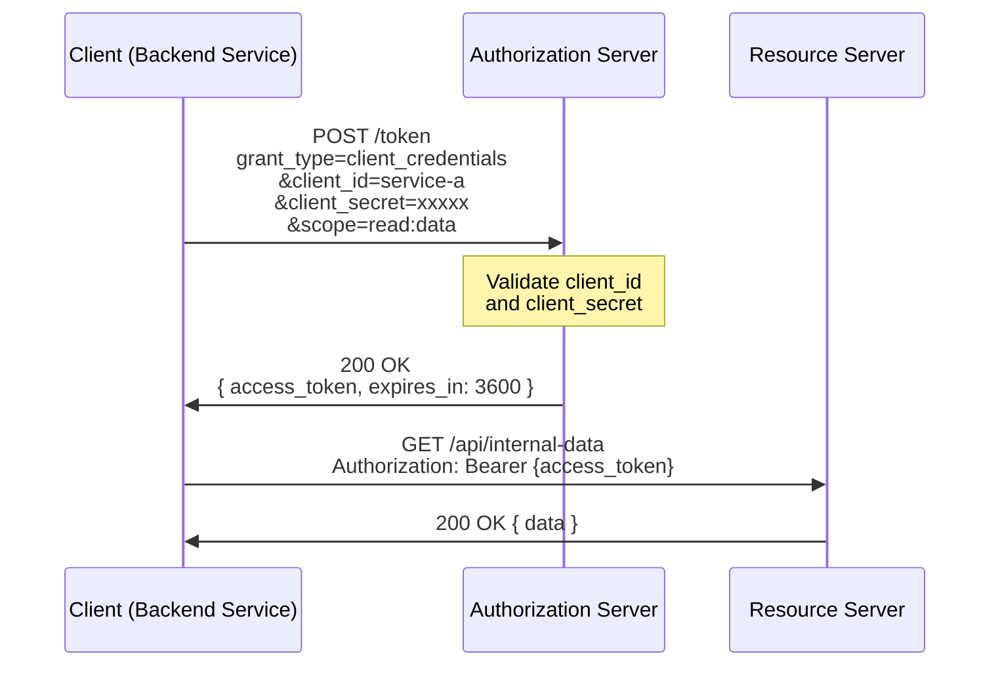
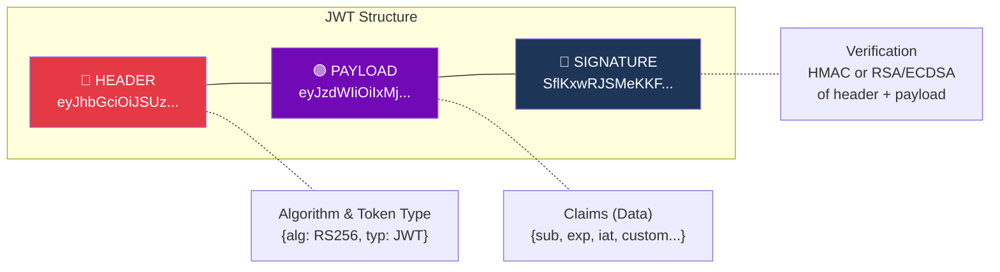
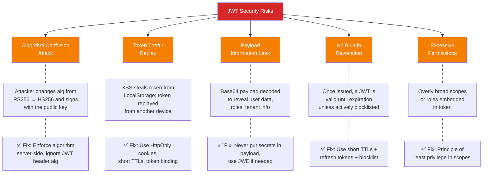
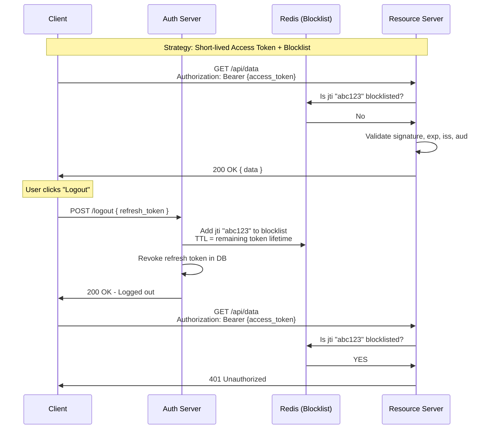
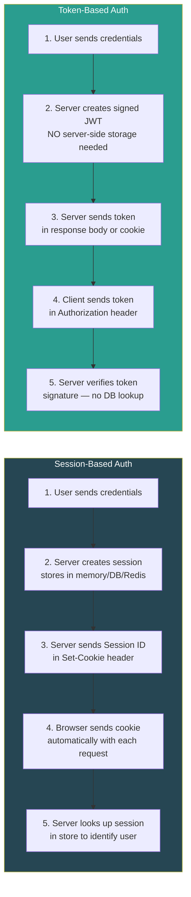

# Part 1 — Identity & Access Management

## Table of Contents

- [1.1 OAuth 2.0 & OpenID Connect (OIDC)](#11-oauth-20-and-openid-connect-oidc)
  - [What Problem Are We Solving?](#what-problem-are-we-solving)
  - [Key Terminology](#key-terminology)
  - [OAuth 2.0 vs. OpenID Connect](#oauth-20-vs-openid-connect)
  - [Grant Types (Flows) Overview](#grant-types-flows-overview)
  - [Flow 1: Authorization Code Flow with PKCE](#flow-1-authorization-code-flow-with-pkce)
    - [Why PKCE?](#why-pkce)
    - [PKCE Mechanism](#pkce-mechanism)
    - [Complete Flow Diagram](#complete-flow-diagram)
    - [Step-by-Step Walkthrough](#step-by-step-walkthrough)
    - [Code Example (Node.js / Express)](#code-example-nodejs-express)
  - [Flow 2: Client Credentials Flow](#flow-2-client-credentials-flow)
    - [Key Characteristics](#key-characteristics)
  - [OIDC — OpenID Connect Additions](#oidc-openid-connect-additions)
    - [ID Token Example (Decoded JWT)](#id-token-example-decoded-jwt)
    - [ID Token Validation Checklist](#id-token-validation-checklist)
- [1.2 JSON Web Tokens (JWTs)](#12-json-web-tokens-jwts)
  - [Anatomy of a JWT](#anatomy-of-a-jwt)
  - [Header](#header)
  - [Payload (Claims)](#payload-claims)
  - [Signature](#signature)
  - [JWT Best Practices](#jwt-best-practices)
    - [✅ DO](#do)
    - [⛔ DON'T](#dont)
  - [JWT Risks & Attacks](#jwt-risks-and-attacks)
  - [JWT Revocation Strategies](#jwt-revocation-strategies)
  - [JWT Storage: HttpOnly Cookies vs. LocalStorage](#jwt-storage-httponly-cookies-vs-localstorage)
    - [Recommendation Matrix](#recommendation-matrix)
    - [Secure Cookie Configuration Example](#secure-cookie-configuration-example)
- [1.3 Session-Based vs. Token-Based Authentication](#13-session-based-vs-token-based-authentication)
  - [Detailed Comparison](#detailed-comparison)
  - [Hybrid Approach (Recommended for Many Applications)](#hybrid-approach-recommended-for-many-applications)


## 1.1 OAuth 2.0 & OpenID Connect (OIDC)

### What Problem Are We Solving?

Before OAuth, if a third-party application wanted to access your data on another service (e.g., a calendar app accessing your Google Calendar), you would have to **give that app your Google password**. This created enormous security risks:

- The third-party app had **full access** to your account
- You couldn't revoke access without **changing your password**
- A breach of the third-party app meant a **breach of your primary account**

> **OAuth 2.0** solves this by acting as a **delegation protocol** — it allows a user to grant a third-party application limited access to a resource without sharing credentials.

### Key Terminology

| Term | Definition |
|---|---|
| **Resource Owner** | The user who owns the data and grants access |
| **Client** | The application requesting access to the user's data |
| **Authorization Server** | The server that authenticates the user and issues tokens (e.g., Google's auth server) |
| **Resource Server** | The API server hosting the protected resources |
| **Access Token** | A credential used to access protected resources (short-lived) |
| **Refresh Token** | A credential used to obtain new access tokens without re-authentication (long-lived) |
| **Scope** | A permission level requested by the client (e.g., `read:email`, `write:calendar`) |
| **Redirect URI** | The URL the authorization server sends the user back to after granting/denying permission |
| **Authorization Code** | A short-lived, one-time-use code exchanged for tokens |

### OAuth 2.0 vs. OpenID Connect

```
┌──────────────────────────────────────────────────────────────┐
│                                                              │
│   OAuth 2.0  = AUTHORIZATION ("What can you do?")            │
│   OIDC       = AUTHENTICATION ("Who are you?") + OAuth 2.0  │
│                                                              │
│   OIDC is a thin identity layer BUILT ON TOP of OAuth 2.0    │
│                                                              │
└──────────────────────────────────────────────────────────────┘
```

| Aspect | OAuth 2.0 | OpenID Connect (OIDC) |
|---|---|---|
| **Purpose** | Authorization (access delegation) | Authentication (identity verification) |
| **Token Issued** | Access Token (+ optional Refresh Token) | ID Token (JWT) + Access Token |
| **User Info** | Not standardized | Standardized via `/userinfo` endpoint and ID Token claims |
| **Use Case** | "Let this app access my photos" | "Log me in with Google" |
| **Standard** | RFC 6749 | Built on OAuth 2.0 with additional specs |

> **Key Insight:** You **cannot** use plain OAuth 2.0 for authentication reliably. OAuth only tells you that someone *authorized* access — not *who they are*. OIDC's **ID Token** solves this by providing verified identity claims.

---

### Grant Types (Flows) Overview



---

### Flow 1: Authorization Code Flow with PKCE

> **PKCE** = **P**roof **K**ey for **C**ode **E**xchange (pronounced "pixy")

#### Why PKCE?

The original Authorization Code Flow relied on a **client secret** to exchange the authorization code for tokens. This works for confidential (server-side) clients but **not** for public clients like SPAs or mobile apps because:

- SPAs cannot securely store a client secret (viewable in browser source)
- Mobile apps can be decompiled
- **Authorization code interception attacks** are possible on mobile (a malicious app registers the same custom URI scheme)

PKCE mitigates this by creating a **dynamic, one-time secret** for each authorization request.

#### PKCE Mechanism

```
1. Client generates a random string:          code_verifier
2. Client hashes it:                           code_challenge = SHA256(code_verifier)
3. Client sends code_challenge with auth request
4. Authorization server stores code_challenge
5. Client sends code_verifier with token exchange
6. Authorization server verifies:              SHA256(code_verifier) === stored code_challenge
```

#### Complete Flow Diagram



#### Step-by-Step Walkthrough

| Step | Action | Security Purpose |
|---|---|---|
| 1 | Generate `code_verifier` + `code_challenge` | Creates a dynamic secret — even if the code is intercepted, the attacker lacks the verifier |
| 2 | Include `state` parameter | Prevents **CSRF attacks** — client verifies the state matches what it sent |
| 3 | User authenticates at Authorization Server | Credentials are **never exposed** to the client application |
| 4 | Auth code returned via redirect | Code is short-lived and single-use |
| 5 | Exchange code + verifier for tokens | Server validates the PKCE proof — only the original requester can complete the exchange |
| 6 | Use access token on Resource Server | The Bearer token provides scoped, time-limited access |

#### Code Example (Node.js / Express)

```javascript
const crypto = require('crypto');
const express = require('express');
const axios = require('axios');
const app = express();

// --- Configuration ---
const CONFIG = {
  clientId: 'your-client-id',
  authorizationEndpoint: 'https://auth.example.com/authorize',
  tokenEndpoint: 'https://auth.example.com/token',
  redirectUri: 'http://localhost:3000/callback',
  scopes: 'openid profile email',
};

// --- PKCE Helper Functions ---
function generateCodeVerifier() {
  // Generate a cryptographically random 32-byte string, base64url-encoded
  return crypto.randomBytes(32).toString('base64url');
}

function generateCodeChallenge(verifier) {
  // SHA-256 hash of the verifier, base64url-encoded
  return crypto.createHash('sha256').update(verifier).digest('base64url');
}

// In production, store these in a server-side session — NOT in memory like this
let pkceStore = {};

// --- Step 1: Initiate Login ---
app.get('/login', (req, res) => {
  const state = crypto.randomBytes(16).toString('hex');
  const codeVerifier = generateCodeVerifier();
  const codeChallenge = generateCodeChallenge(codeVerifier);

  // Store for later verification
  pkceStore[state] = { codeVerifier };

  const authUrl = new URL(CONFIG.authorizationEndpoint);
  authUrl.searchParams.set('response_type', 'code');
  authUrl.searchParams.set('client_id', CONFIG.clientId);
  authUrl.searchParams.set('redirect_uri', CONFIG.redirectUri);
  authUrl.searchParams.set('scope', CONFIG.scopes);
  authUrl.searchParams.set('state', state);
  authUrl.searchParams.set('code_challenge', codeChallenge);
  authUrl.searchParams.set('code_challenge_method', 'S256');

  res.redirect(authUrl.toString());
});

// --- Step 2: Handle Callback ---
app.get('/callback', async (req, res) => {
  const { code, state } = req.query;

  // Verify state to prevent CSRF
  if (!pkceStore[state]) {
    return res.status(403).send('Invalid state — possible CSRF attack');
  }

  const { codeVerifier } = pkceStore[state];
  delete pkceStore[state]; // Single-use

  try {
    // Exchange authorization code for tokens
    const tokenResponse = await axios.post(CONFIG.tokenEndpoint, 
      new URLSearchParams({
        grant_type: 'authorization_code',
        code: code,
        redirect_uri: CONFIG.redirectUri,
        client_id: CONFIG.clientId,
        code_verifier: codeVerifier,  // PKCE proof
      }),
      { headers: { 'Content-Type': 'application/x-www-form-urlencoded' } }
    );

    const { access_token, id_token, refresh_token } = tokenResponse.data;

    // In production: validate the id_token, set secure session cookies, etc.
    res.json({ message: 'Authenticated!', access_token, id_token });
  } catch (error) {
    res.status(500).json({ error: 'Token exchange failed', details: error.message });
  }
});

app.listen(3000, () => console.log('Server running on http://localhost:3000'));
```

---

### Flow 2: Client Credentials Flow

> **Use case:** Machine-to-machine (M2M) communication where **no user is involved**.

Examples:
- A backend service calling another backend service
- A cron job accessing an API
- Microservice-to-microservice communication



#### Key Characteristics

| Property | Detail |
|---|---|
| **User Involvement** | None — purely service-to-service |
| **Credentials** | Client ID + Client Secret (must be stored securely, e.g., vault) |
| **Token Type** | Access Token only (no Refresh Token, no ID Token) |
| **Security** | Secret must NEVER be exposed in client-side code |
| **Token Lifetime** | Typically short (1 hour); client requests new token when expired |

```python
# Python example using requests
import requests

def get_m2m_token():
    """Obtain an access token using Client Credentials flow."""
    response = requests.post(
        'https://auth.example.com/token',
        data={
            'grant_type': 'client_credentials',
            'client_id': 'service-account-id',
            'client_secret': 'super-secret-key',  # From a vault, NOT hardcoded
            'scope': 'read:reports write:logs',
        },
        headers={'Content-Type': 'application/x-www-form-urlencoded'}
    )
    response.raise_for_status()
    return response.json()['access_token']

def call_protected_api():
    """Call a protected API using the M2M token."""
    token = get_m2m_token()
    response = requests.get(
        'https://api.example.com/internal/reports',
        headers={'Authorization': f'Bearer {token}'}
    )
    return response.json()
```

---

### OIDC — OpenID Connect Additions

OIDC adds the following on top of OAuth 2.0:

| OIDC Concept | Purpose |
|---|---|
| **ID Token** | A JWT containing identity claims (who the user is) |
| **`/userinfo` endpoint** | Returns claims about the authenticated user |
| **`openid` scope** | Signals to the Authorization Server that OIDC is being used |
| **Standard claims** | `sub`, `name`, `email`, `picture`, etc. |
| **Discovery document** | `/.well-known/openid-configuration` — metadata about all endpoints |

#### ID Token Example (Decoded JWT)

```json
{
  "header": {
    "alg": "RS256",
    "typ": "JWT",
    "kid": "key-id-123"
  },
  "payload": {
    "iss": "https://auth.example.com",        // Issuer
    "sub": "user-uuid-12345",                  // Subject (unique user ID)
    "aud": "your-client-id",                   // Audience (your app)
    "exp": 1700000000,                         // Expiration time
    "iat": 1699996400,                         // Issued at
    "nonce": "random-nonce-value",             // Replay protection
    "name": "Jane Doe",
    "email": "jane@example.com",
    "email_verified": true,
    "picture": "https://example.com/jane.jpg"
  }
}
```

#### ID Token Validation Checklist

```
✅ Verify the signature using the issuer's public key (from JWKS endpoint)
✅ Check `iss` matches your expected authorization server
✅ Check `aud` matches your client_id
✅ Check `exp` has not passed (token not expired)
✅ Check `nonce` matches the one you sent in the authorization request
✅ Check `iat` is not too far in the past
⛔ NEVER trust an ID token without verifying ALL of the above
```

---

## 1.2 JSON Web Tokens (JWTs)

### Anatomy of a JWT

A JWT consists of three parts separated by dots: `header.payload.signature`



### Header

```json
{
  "alg": "RS256",   // Signing algorithm
  "typ": "JWT",     // Token type
  "kid": "key-123"  // Key ID (used to look up the correct public key)
}
```

### Payload (Claims)

| Claim Type | Examples | Purpose |
|---|---|---|
| **Registered** | `iss`, `sub`, `aud`, `exp`, `iat`, `nbf`, `jti` | Standardized by IANA; interoperable |
| **Public** | `name`, `email`, `roles` | Defined in IANA registry or collision-resistant |
| **Private** | `tenant_id`, `plan`, `permissions` | Custom claims agreed upon between parties |

```json
{
  "iss": "https://auth.example.com",
  "sub": "user-12345",
  "aud": "https://api.example.com",
  "exp": 1700003600,
  "iat": 1700000000,
  "jti": "unique-token-id-abc",
  "roles": ["admin", "editor"],
  "tenant_id": "org-789"
}
```

### Signature

```
// For HMAC (symmetric)
HMACSHA256(
  base64UrlEncode(header) + "." + base64UrlEncode(payload),
  secret
)

// For RSA (asymmetric) — PREFERRED for distributed systems
RSASHA256(
  base64UrlEncode(header) + "." + base64UrlEncode(payload),
  privateKey
)
// Verification uses the corresponding publicKey
```

---

### JWT Best Practices

#### ✅ DO

```
1. Use asymmetric algorithms (RS256, ES256) for distributed systems
   → Authorization server signs with private key
   → Resource servers verify with public key
   → No shared secret needed

2. Set short expiration times for access tokens (5–15 minutes)

3. Always validate ALL claims:
   - iss (issuer)
   - aud (audience)
   - exp (expiration)
   - nbf (not before)
   - Signature

4. Use the `kid` (Key ID) header to support key rotation

5. Keep payloads small — JWTs are sent with EVERY request

6. Use `jti` (JWT ID) for token revocation tracking

7. Transmit only over HTTPS
```

#### ⛔ DON'T

```
1. NEVER store sensitive data in the payload
   → JWTs are base64-encoded, NOT encrypted (anyone can decode them)
   → Unless you use JWE (JSON Web Encryption)

2. NEVER use `alg: "none"` — this disables signature verification

3. NEVER accept the algorithm FROM the token header without validation
   → Always enforce expected algorithms server-side
   → This prevents "algorithm confusion" attacks

4. NEVER use JWTs as session replacements without understanding
   the revocation implications

5. NEVER set excessively long expiration times
```

---

### JWT Risks & Attacks



---

### JWT Revocation Strategies

Since JWTs are **stateless** and self-contained, they have **no built-in revocation mechanism**. Here are strategies to handle this:

| Strategy | How It Works | Pros | Cons |
|---|---|---|---|
| **Short-lived tokens + Refresh tokens** | Access tokens expire in 5–15 min. Refresh tokens (stored securely) are used to obtain new ones. Revoking the refresh token prevents new access tokens. | Simple, stateless for most requests | User has access until current token expires |
| **Token blocklist (deny list)** | Store revoked token `jti` values in a fast store (Redis). Check each request. | Immediate revocation | Adds state; extra latency per request |
| **Token versioning** | Store a `tokenVersion` per user in DB. Increment on logout/password change. Reject tokens with old version. | Revokes all tokens for a user at once | Requires DB lookup per request |
| **Refresh token rotation** | Issue a new refresh token with every use. Detect reuse of old refresh token → revoke entire family. | Detects token theft | Slightly more complex |



---

### JWT Storage: HttpOnly Cookies vs. LocalStorage

This is one of the most debated topics in web security. Here is an objective comparison:

| Factor | HttpOnly Cookie | LocalStorage |
|---|---|---|
| **XSS Protection** | ✅ **Immune** — JavaScript cannot access HttpOnly cookies | ⛔ **Vulnerable** — XSS can read and exfiltrate the token |
| **CSRF Protection** | ⛔ **Vulnerable** — cookies are sent automatically with requests | ✅ **Immune** — tokens must be manually attached to requests |
| **Ease of Use** | Moderate — requires cookie configuration, SameSite, Secure flags | Easy — simple `getItem`/`setItem` API |
| **Cross-Domain** | Complex — requires specific CORS + credential settings | Simple — token manually added to Authorization header |
| **Mobile/Native Apps** | Not applicable (no cookies in native mobile apps) | N/A — native apps use secure storage (Keychain, Keystore) |
| **Server-Side Rendering** | ✅ Cookies sent automatically on initial page load | ⛔ Token not available during SSR |

#### Recommendation Matrix

```
┌─────────────────────────────────────────────────────────────────┐
│                                                                 │
│  🏆 RECOMMENDED: HttpOnly + Secure + SameSite=Strict cookies   │
│     + CSRF token for any state-changing requests                │
│                                                                 │
│  WHY: XSS is more prevalent and harder to fully prevent         │
│       than CSRF. CSRF has well-understood mitigations            │
│       (SameSite cookies, CSRF tokens, origin checking).         │
│                                                                 │
│  For SPAs calling same-origin APIs:                             │
│     → HttpOnly cookies with SameSite=Strict                     │
│                                                                 │
│  For SPAs calling cross-origin APIs:                            │
│     → HttpOnly cookies with SameSite=Lax + CSRF protection     │
│     → OR Backend-for-Frontend (BFF) pattern                     │
│                                                                 │
│  For native mobile apps:                                        │
│     → Secure OS-level storage (iOS Keychain, Android Keystore)  │
│                                                                 │
└─────────────────────────────────────────────────────────────────┘
```

#### Secure Cookie Configuration Example

```javascript
// Setting a JWT in an HttpOnly cookie (Express.js)
res.cookie('access_token', jwtToken, {
  httpOnly: true,        // Not accessible via JavaScript
  secure: true,          // Only sent over HTTPS
  sameSite: 'Strict',    // Not sent with cross-site requests
  maxAge: 15 * 60 * 1000, // 15 minutes
  path: '/',             // Available on all paths
  domain: '.example.com' // Available on subdomains
});
```

---

## 1.3 Session-Based vs. Token-Based Authentication



### Detailed Comparison

| Aspect | Session-Based | Token-Based (JWT) |
|---|---|---|
| **State** | Stateful — session data stored server-side | Stateless — all data embedded in the token |
| **Storage** | Server: memory/Redis/DB. Client: cookie with Session ID | Client: cookie or header. Server: nothing |
| **Scalability** | Requires shared session store for horizontal scaling | Naturally scalable — any server can verify the token |
| **Revocation** | ✅ Easy — delete session from store | ⛔ Hard — requires blocklist or short TTLs |
| **Size** | Small cookie (~20 bytes for session ID) | Larger (~800+ bytes for JWT with claims) |
| **Cross-Domain** | Difficult — cookies are domain-bound | Easy — tokens sent via headers work cross-domain |
| **Mobile** | Awkward — cookies aren't native to mobile | Natural — tokens stored in secure device storage |
| **Security Risk** | Session fixation, session hijacking | Token theft, algorithm confusion, no revocation |
| **Performance** | DB/Redis lookup per request | CPU-bound signature verification per request |
| **Best For** | Traditional web apps, monoliths, apps needing instant revocation | APIs, microservices, mobile backends, distributed systems |

### Hybrid Approach (Recommended for Many Applications)

```
┌─────────────────────────────────────────────────────────────────┐
│                                                                 │
│  HYBRID: Use BOTH sessions and tokens where appropriate         │
│                                                                 │
│  ┌──────────────┐     ┌──────────────┐     ┌──────────────┐    │
│  │  Browser/SPA │     │   BFF / API  │     │ Microservices│    │
│  │              │────▶│   Gateway    │────▶│              │    │
│  │  Session     │     │              │     │   JWT-based  │    │
│  │  Cookie      │     │  Session →   │     │   Auth       │    │
│  │              │     │  JWT bridge  │     │              │    │
│  └──────────────┘     └──────────────┘     └──────────────┘    │
│                                                                 │
│  The gateway maintains sessions with the browser (easy          │
│  revocation) and issues short-lived JWTs for internal           │
│  microservice calls (scalability).                              │
│                                                                 │
└─────────────────────────────────────────────────────────────────┘
```

---

