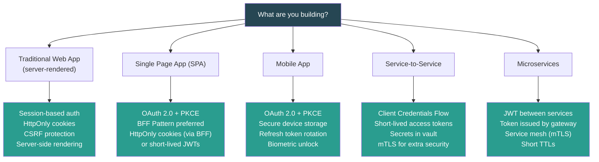

# Quick Reference Cheat Sheet

## Table of Contents

- [Authentication & Authorization Decision Matrix](#authentication-and-authorization-decision-matrix)
- [Security Headers Checklist](#security-headers-checklist)
- [Security Anti-Patterns](#security-anti-patterns)


## Authentication & Authorization Decision Matrix



## Security Headers Checklist

```
# Add ALL of these to your HTTP responses:

Strict-Transport-Security: max-age=63072000; includeSubDomains; preload
Content-Security-Policy: default-src 'self'; script-src 'self' 'nonce-{random}'; object-src 'none'
X-Content-Type-Options: nosniff
X-Frame-Options: DENY
Referrer-Policy: strict-origin-when-cross-origin
Permissions-Policy: camera=(), microphone=(), geolocation=()
Cache-Control: no-store (for sensitive pages)
```

## Security Anti-Patterns

```
⛔ Storing passwords in plaintext or with reversible encryption
⛔ Using MD5 or SHA-1/SHA-256 for password hashing
⛔ Storing JWTs in LocalStorage
⛔ Using alg: "none" in JWTs
⛔ Reflecting user input without encoding
⛔ Building SQL queries with string concatenation
⛔ Setting Access-Control-Allow-Origin: *  with credentials
⛔ Long-lived JWTs with no revocation strategy
⛔ Client-side only authorization checks
⛔ Hardcoding secrets in source code
⛔ Trusting the Origin/Referer header without validation
⛔ Using HTTP in production (always use HTTPS/TLS)
```

---

