# Part I — Design Principles & Patterns

## Table of Contents

- [1.1 Core Design Principles](#11-core-design-principles)
  - [Relationship Between the Principles](#relationship-between-the-principles)
  - [1.1.1 SOLID Principles](#111-solid-principles)
    - [Deep Dive: Dependency Inversion](#deep-dive-dependency-inversion)
    - [Code Example — SRP + DIP in Practice](#code-example-srp-dip-in-practice)
  - [1.1.2 DRY — Don't Repeat Yourself](#112-dry-dont-repeat-yourself)
  - [1.1.3 KISS — Keep It Simple, Stupid](#113-kiss-keep-it-simple-stupid)
  - [1.1.4 YAGNI — You Ain't Gonna Need It](#114-yagni-you-aint-gonna-need-it)
- [1.2 Gang of Four (GoF) Design Patterns](#12-gang-of-four-gof-design-patterns)
  - [GoF Pattern Families Overview](#gof-pattern-families-overview)
  - [1.2.1 Factory Method (Creational)](#121-factory-method-creational)
  - [1.2.2 Strategy (Behavioral)](#122-strategy-behavioral)
  - [1.2.3 Observer (Behavioral)](#123-observer-behavioral)
  - [1.2.4 Adapter (Structural)](#124-adapter-structural)
  - [1.2.5 Decorator (Structural)](#125-decorator-structural)
  - [GoF Patterns — Quick-Reference Selection Guide](#gof-patterns-quick-reference-selection-guide)
- [1.3 Domain-Driven Design (DDD)](#13-domain-driven-design-ddd)
  - [DDD Strategic & Tactical Landscape](#ddd-strategic-and-tactical-landscape)
  - [1.3.1 Ubiquitous Language](#131-ubiquitous-language)
  - [1.3.2 Bounded Contexts](#132-bounded-contexts)
    - [Context Mapping Patterns](#context-mapping-patterns)
  - [1.3.3 Aggregates](#133-aggregates)
  - [1.3.4 Value Objects](#134-value-objects)
  - [DDD — Complete Layered Architecture](#ddd-complete-layered-architecture)


## 1.1 Core Design Principles

These four complementary heuristics form a decision-making compass for every line of code, every module boundary, and every architectural choice.

### Relationship Between the Principles

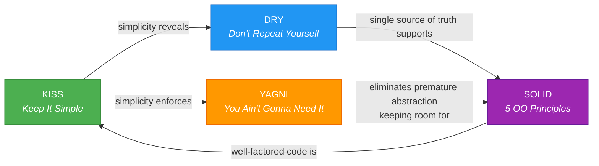

---

### 1.1.1 SOLID Principles

| # | Principle | Formal Statement | Plain-Language Rule | Violation Smell |
|---|-----------|-----------------|---------------------|-----------------|
| **S** | Single Responsibility | A class should have only one reason to change. | One job per module. | God classes, "Util" classes that grow forever. |
| **O** | Open/Closed | Software entities should be open for extension but closed for modification. | Add behavior without editing existing code. | Massive `switch/case` blocks, rewriting core logic for each new variant. |
| **L** | Liskov Substitution | Subtypes must be substitutable for their base types without altering correctness. | Subclasses must honor the contract of their parent. | Overridden methods that throw `NotSupportedException`. |
| **I** | Interface Segregation | No client should be forced to depend on methods it does not use. | Prefer many small interfaces over one fat interface. | Interfaces with 20+ methods where implementors stub half of them. |
| **D** | Dependency Inversion | High-level modules should not depend on low-level modules; both should depend on abstractions. | Depend on contracts, not concrete implementations. | Direct `new` of infrastructure classes (DB drivers, HTTP clients) deep inside business logic. |

#### Deep Dive: Dependency Inversion

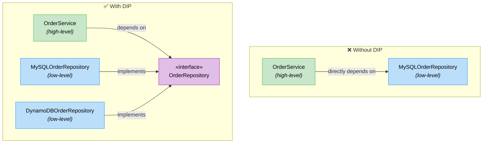

> **Principal-level insight:** DIP is the architectural backbone behind Hexagonal Architecture (Ports & Adapters). The "ports" _are_ the abstractions; the "adapters" _are_ the swappable implementations. When you enforce DIP consistently, you naturally arrive at testable, infrastructure-agnostic business logic.

#### Code Example — SRP + DIP in Practice

```python
# ─── Abstraction (Port) ───────────────────────────────
from abc import ABC, abstractmethod

class PaymentGateway(ABC):
    """Contract — high-level policy depends on this."""
    @abstractmethod
    def charge(self, amount_cents: int, token: str) -> str:
        """Returns a transaction ID."""
        ...

# ─── Low-level adapter ────────────────────────────────
class StripeGateway(PaymentGateway):
    def charge(self, amount_cents: int, token: str) -> str:
        # Stripe SDK call …
        return stripe.Charge.create(amount=amount_cents, source=token).id

# ─── High-level policy (SRP: only orchestrates payment) ─
class CheckoutService:
    def __init__(self, gateway: PaymentGateway):   # DIP: depends on abstraction
        self._gateway = gateway

    def complete(self, cart, payment_token: str) -> str:
        total = cart.total_cents()
        return self._gateway.charge(total, payment_token)
```

---

### 1.1.2 DRY — Don't Repeat Yourself

> *"Every piece of knowledge must have a single, unambiguous, authoritative representation within a system."*
> — Andy Hunt & Dave Thomas, *The Pragmatic Programmer*

| Concept | Description |
|---------|-------------|
| **What it IS** | Eliminating _knowledge_ duplication: business rules, schema definitions, configuration constants. |
| **What it is NOT** | Blindly merging two code blocks that _look_ similar but represent different domain concepts. |
| **Danger of over-applying** | Premature DRY leads to **wrong abstractions** that couple unrelated concerns (see "AHA Programming — Avoid Hasty Abstractions"). |

**Rule of Three:** Consider extracting only after you see the **third** instance of genuine duplication. The first two occurrences may diverge.

---

### 1.1.3 KISS — Keep It Simple, Stupid

| Guideline | Example |
|-----------|---------|
| Prefer explicit over clever. | A straightforward `for` loop over a chained ternary one-liner. |
| Choose boring technology for solved problems. | PostgreSQL over a brand-new distributed SQL engine — unless you've proven the need. |
| Minimize moving parts. | Synchronous request-response before event-driven choreography, until latency or scale demands otherwise. |

> **Principal-level checkpoint:** Before adding a framework, library, or architectural layer, ask: *"What is the simplest thing that could possibly work, and what evidence do I have that it won't?"*

---

### 1.1.4 YAGNI — You Ain't Gonna Need It

YAGNI prevents **speculative generality** — building extension points, generic factories, or configuration-driven behavior for requirements that _might_ arrive someday.

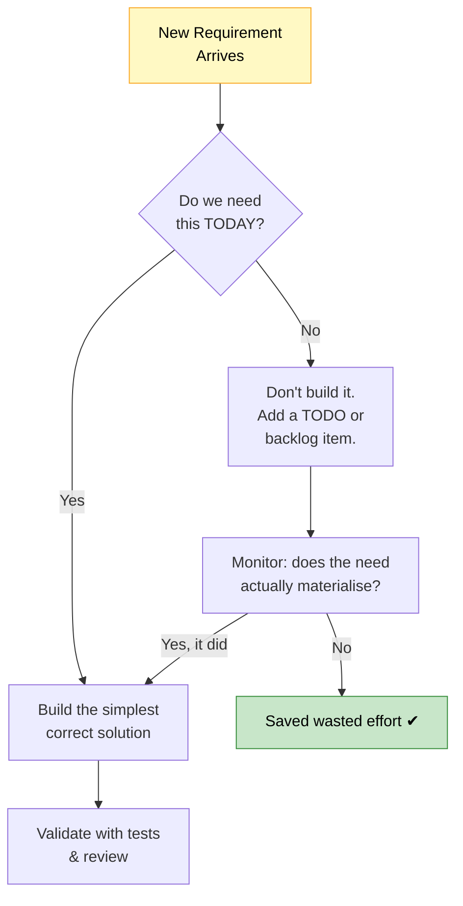

**Cost of violating YAGNI:**

| Hidden Cost | Impact |
|------------|--------|
| Extra code to maintain | Increased surface area for bugs. |
| Cognitive overhead | New team members must understand unused abstractions. |
| Delayed delivery | Time spent building unused features is time not spent on real requirements. |
| Wrong abstractions | Premature generalization often guesses the wrong axis of change. |

---

## 1.2 Gang of Four (GoF) Design Patterns

The 23 GoF patterns (1994) are grouped into three families. Below we deep-dive into the six most commonly referenced at the principal level.

### GoF Pattern Families Overview

```mermaid
graph TB
    GoF["Gang of Four<br/>Design Patterns"]
    GoF --> C["Creational<br/><i>Object creation</i>"]
    GoF --> S["Structural<br/><i>Object composition</i>"]
    GoF --> B["Behavioral<br/><i>Object interaction</i>"]

    C --> C1["Factory Method"]
    C --> C2["Abstract Factory"]
    C --> C3["Builder"]
    C --> C4["Singleton"]
    C --> C5["Prototype"]

    S --> S1["Adapter"]
    S --> S2["Decorator"]
    S --> S3["Facade"]
    S --> S4["Composite"]
    S --> S5["Bridge"]
    S --> S6["Proxy"]
    S --> S7["Flyweight"]

    B --> B1["Strategy"]
    B --> B2["Observer"]
    B --> B3["Command"]
    B --> B4["State"]
    B --> B5["Template Method"]
    B --> B6["Iterator"]
    B --> B7["Mediator"]
    B --> B8["Chain of Resp."]
    B --> B9["Visitor"]
    B --> B10["Memento"]
    B --> B11["Interpreter"]

    style GoF fill:#9C27B0,color:#fff
    style C fill:#4CAF50,color:#fff
    style S fill:#2196F3,color:#fff
    style B fill:#FF9800,color:#fff

    style C1 fill:#C8E6C9
    style C2 fill:#C8E6C9
    style C3 fill:#C8E6C9
    style C4 fill:#C8E6C9
    style C5 fill:#C8E6C9

    style S1 fill:#BBDEFB
    style S2 fill:#BBDEFB
    style S3 fill:#BBDEFB
    style S4 fill:#BBDEFB
    style S5 fill:#BBDEFB
    style S6 fill:#BBDEFB
    style S7 fill:#BBDEFB

    style B1 fill:#FFE0B2
    style B2 fill:#FFE0B2
    style B3 fill:#FFE0B2
    style B4 fill:#FFE0B2
    style B5 fill:#FFE0B2
    style B6 fill:#FFE0B2
    style B7 fill:#FFE0B2
    style B8 fill:#FFE0B2
    style B9 fill:#FFE0B2
    style B10 fill:#FFE0B2
    style B11 fill:#FFE0B2
```

---

### 1.2.1 Factory Method (Creational)

**Intent:** Define an interface for creating an object, but let subclasses decide which class to instantiate.

**When to use:** You need to decouple creation logic from usage, especially when the concrete type depends on runtime context (config, environment, user input).

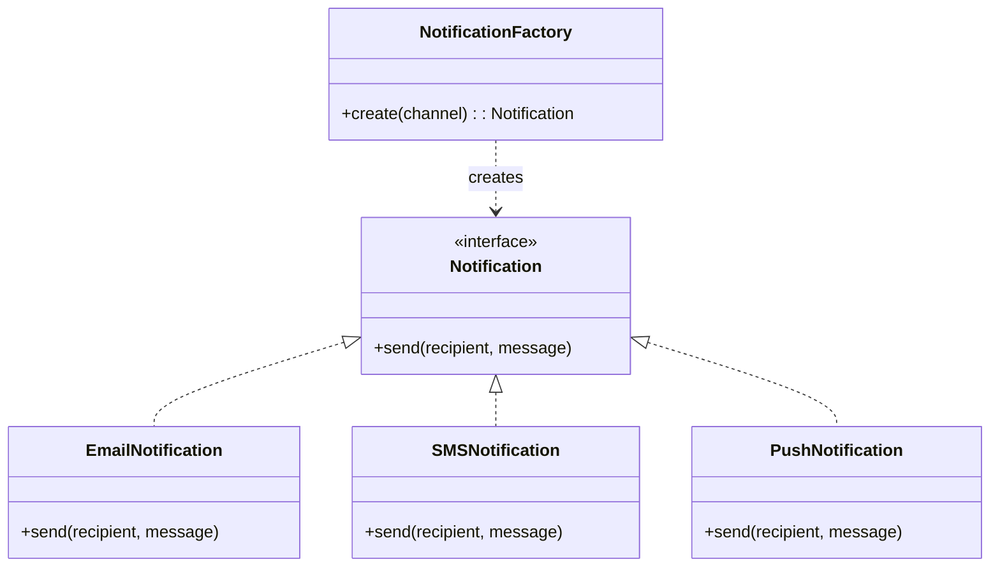

```python
class NotificationFactory:
    _registry: dict[str, type[Notification]] = {
        "email": EmailNotification,
        "sms":   SMSNotification,
        "push":  PushNotification,
    }

    @classmethod
    def create(cls, channel: str) -> Notification:
        klass = cls._registry.get(channel)
        if klass is None:
            raise ValueError(f"Unknown channel: {channel}")
        return klass()
```

> **Tip:** Combine with a **registry pattern** (dict/map lookup) to achieve Open/Closed — adding a new channel means registering a new class, not editing `if/else` chains.

---

### 1.2.2 Strategy (Behavioral)

**Intent:** Define a family of algorithms, encapsulate each one, and make them interchangeable at runtime.

**When to use:** You have multiple ways to perform an operation (pricing, sorting, compression) and want to select the approach without conditional branching.

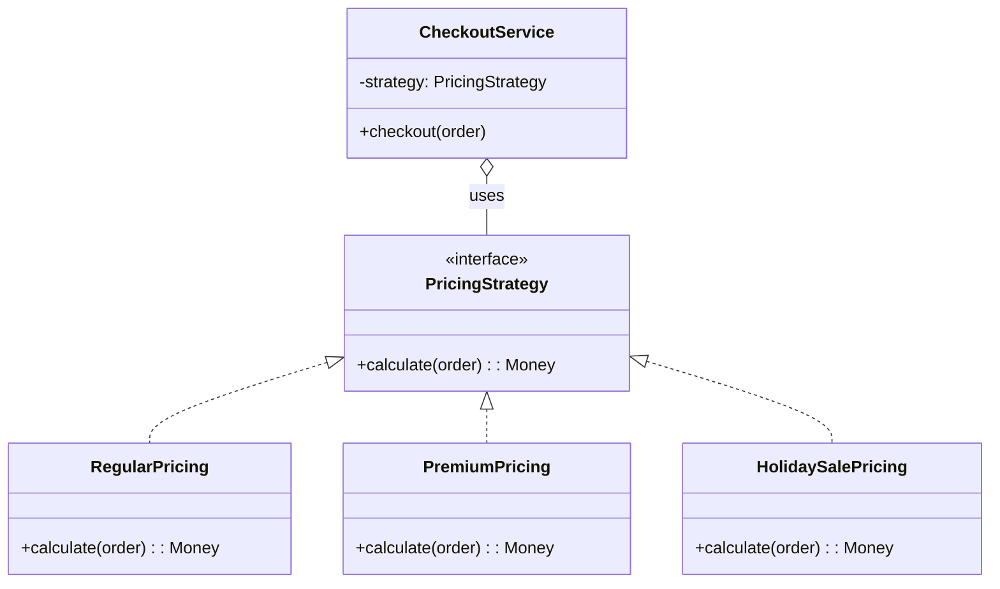

**SOLID connection:** Strategy is a direct embodiment of **OCP** (new algorithms without modifying `CheckoutService`) and **DIP** (depending on the `PricingStrategy` abstraction).

---

### 1.2.3 Observer (Behavioral)

**Intent:** Define a one-to-many dependency so that when one object changes state, all dependents are notified and updated automatically.

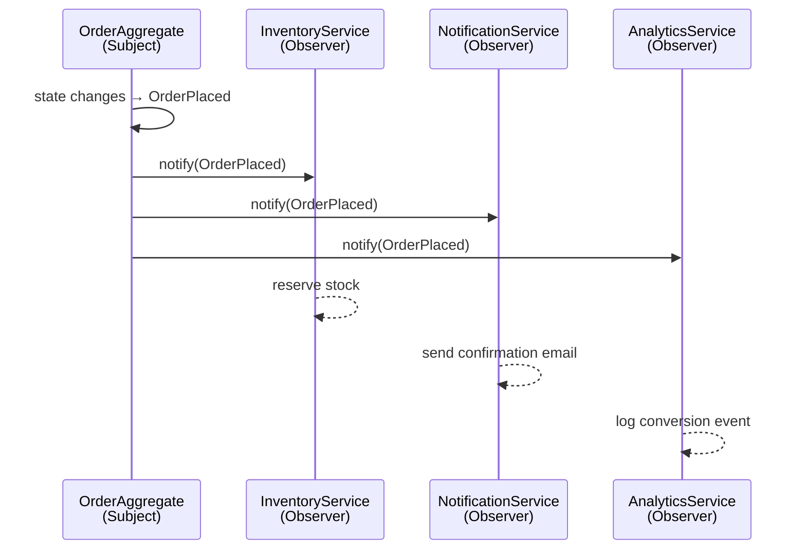

**Modern equivalents:**

| In-Process | Distributed |
|-----------|-------------|
| Event emitters, Reactive Streams (`RxJava`, `Project Reactor`) | Message brokers (Kafka topics, SNS/SQS fan-out), webhooks |

> **Principal-level caution:** In-process observer chains run synchronously by default — a slow observer blocks the publisher. Decide early whether notification should be sync, async-in-process, or fully decoupled via a message bus.

---

### 1.2.4 Adapter (Structural)

**Intent:** Convert the interface of a class into another interface that clients expect. Lets classes work together that couldn't otherwise because of incompatible interfaces.

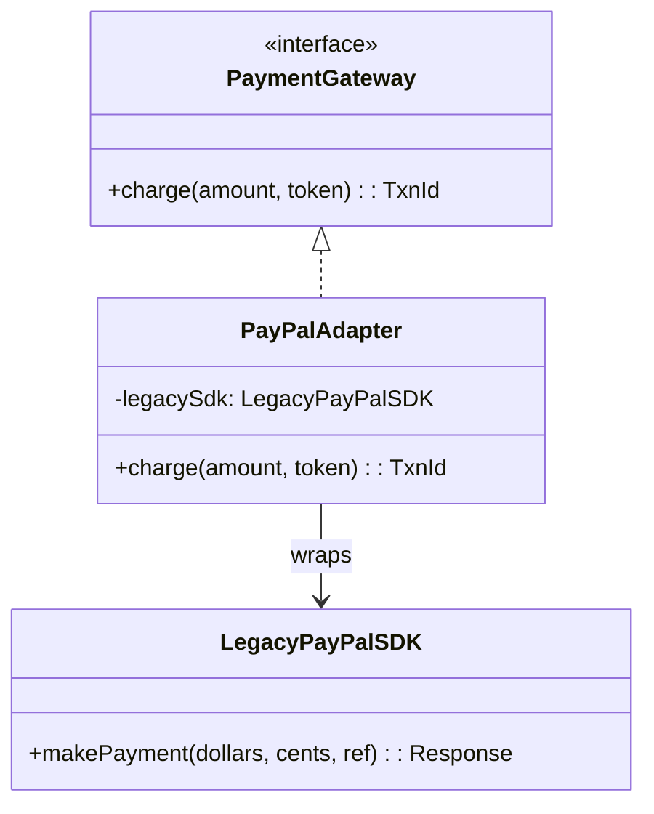

**Real-world scenario:** You're migrating from a legacy payment SDK. Rather than rewriting all call sites, you wrap the old SDK behind the `PaymentGateway` interface your codebase already uses. Later, the adapter is swapped for a native implementation — zero changes to callers.

---

### 1.2.5 Decorator (Structural)

**Intent:** Attach additional responsibilities to an object dynamically. Decorators provide a flexible alternative to subclassing for extending functionality.

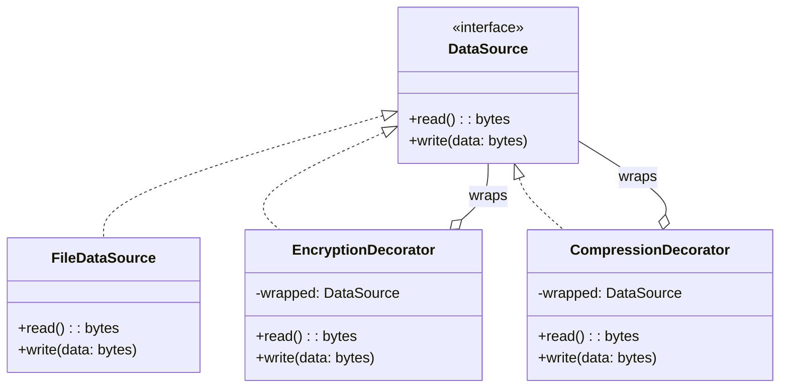

```python
# Composable at runtime:
source = CompressionDecorator(
            EncryptionDecorator(
                FileDataSource("secrets.dat")
            )
         )
source.write(b"sensitive payload")
# write path: compress → encrypt → file
# read  path: file → decrypt → decompress
```

**Key insight:** Each decorator satisfies the same interface as the component it wraps — they are stackable like layers. This is the same idea behind middleware pipelines (Express.js, ASP.NET, Django middleware).

---

### GoF Patterns — Quick-Reference Selection Guide

| Problem Space | Consider Pattern | Why |
|--------------|-----------------|-----|
| "I need to create objects without specifying exact classes." | **Factory / Abstract Factory** | Decouples creation from use. |
| "I have multiple interchangeable algorithms." | **Strategy** | Eliminates conditional branching. |
| "Multiple subsystems need to react to a state change." | **Observer** | Decouples publisher from subscribers. |
| "I must integrate an incompatible third-party API." | **Adapter** | Wraps foreign interface behind your contract. |
| "I want to layer on cross-cutting behavior (logging, auth, caching)." | **Decorator** | Adds behavior without modifying core class. |
| "I need to simplify interaction with a complex subsystem." | **Facade** | Provides a unified, simplified interface. |
| "An object's behavior should change with its internal state." | **State** | Replaces state-based `if/else` with polymorphism. |

---

## 1.3 Domain-Driven Design (DDD)

DDD is a philosophy for tackling complex business domains by keeping the **model** at the center of all design conversations.

### DDD Strategic & Tactical Landscape

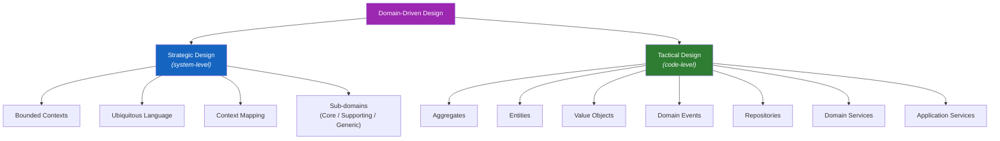

---

### 1.3.1 Ubiquitous Language

> The single most important practice in DDD.

Ubiquitous Language is a **shared vocabulary** between developers, product managers, and domain experts that is reflected _directly_ in the code (class names, method names, event names).

| Practice | Anti-Pattern |
|----------|-------------|
| The code says `Policy`, `Claim`, `Adjudication` — the same terms the underwriter uses. | The code says `DataProcessor`, `Item`, `handleStuff`. |
| A new domain concept triggers a naming discussion with domain experts. | Developers invent names in isolation; business stakeholders can't read the code. |

**Enforcement techniques:**
- Glossaries maintained in the repo (`docs/ubiquitous-language.md`).
- Linting rules that flag generic names.
- Code review checklists that require domain-appropriate naming.

---

### 1.3.2 Bounded Contexts

A Bounded Context is the **explicit boundary** within which a particular domain model is defined and applicable. The same real-world concept (e.g., "Customer") may have different representations in different contexts.

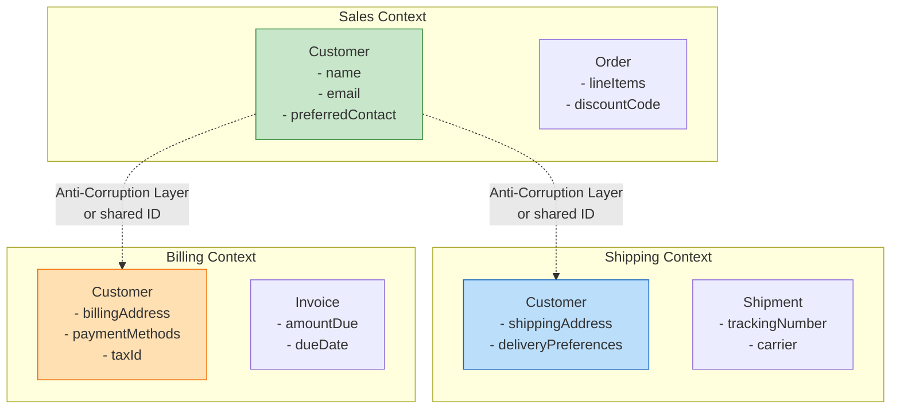

> **Key rule:** "Customer" in Sales is _not the same model_ as "Customer" in Billing. Attempting to share a single `Customer` class across all contexts leads to a tangled, ever-growing God Object.

#### Context Mapping Patterns

| Pattern | Description | When to Use |
|---------|-------------|-------------|
| **Shared Kernel** | Two contexts share a small, co-owned subset of the model. | Tightly coupled teams willing to co-evolve. |
| **Anti-Corruption Layer (ACL)** | A translation layer that insulates your context from a foreign model. | Integrating with legacy or third-party systems. |
| **Customer / Supplier** | Upstream context serves the downstream context. | Clear producer/consumer relationship. |
| **Conformist** | Downstream adopts the upstream model as-is. | When the upstream team won't accommodate changes. |
| **Open Host Service + Published Language** | Upstream offers a well-defined API/protocol for all consumers. | Public APIs, platform services. |
| **Separate Ways** | No integration — each context solves the problem independently. | When integration cost outweighs benefit. |

---

### 1.3.3 Aggregates

An **Aggregate** is a cluster of domain objects treated as a single unit for data changes. It has:

1. An **Aggregate Root** — the only entry point for external access.
2. **Consistency boundary** — all invariants within the aggregate are enforced transactionally.
3. **Identity** — the root carries a unique identity; internal entities may have local identity.

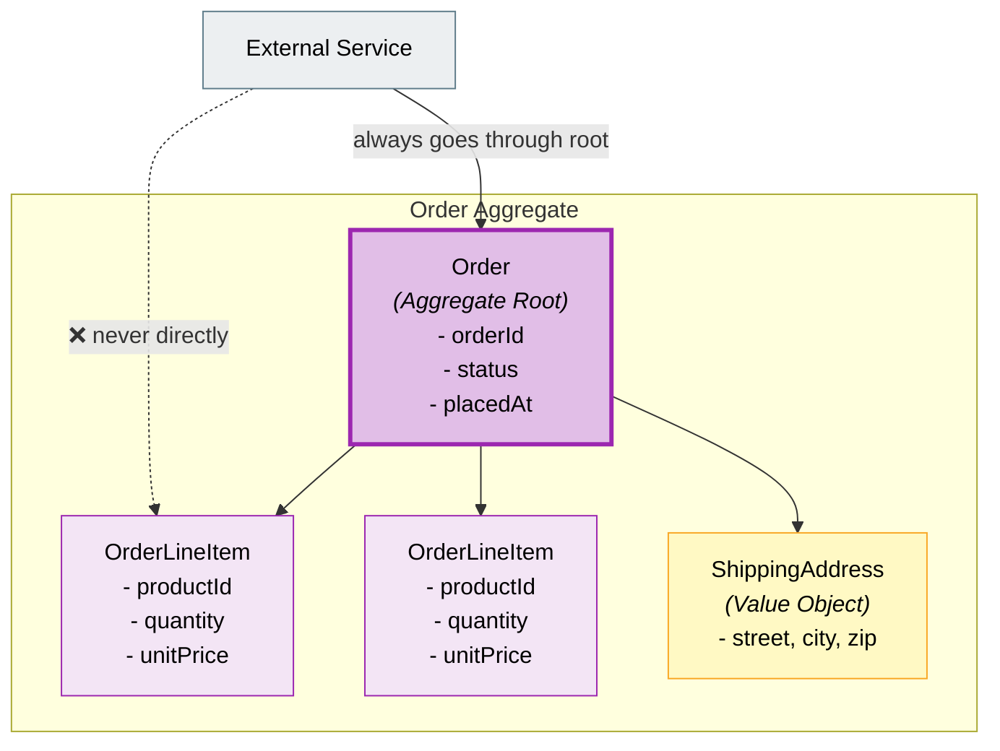

**Aggregate Design Rules (Vaughn Vernon):**

| Rule | Rationale |
|------|-----------|
| Design small aggregates. | Large aggregates create contention, merge conflicts, and transaction failures. |
| Reference other aggregates by identity only. | Prevents object-graph loading and cross-aggregate coupling. |
| Use eventual consistency between aggregates. | Only the _aggregate itself_ must be immediately consistent; inter-aggregate rules can be async. |
| Update one aggregate per transaction. | Simplifies concurrency; enables scaling. |

---

### 1.3.4 Value Objects

A **Value Object** is defined by its _attributes_, not by an identity. Two Value Objects with the same attributes are equal.

```python
from dataclasses import dataclass

@dataclass(frozen=True)   # immutable
class Money:
    amount: int            # in minor units (cents)
    currency: str          # ISO 4217

    def add(self, other: "Money") -> "Money":
        if self.currency != other.currency:
            raise ValueError("Cannot add different currencies")
        return Money(self.amount + other.amount, self.currency)

# Two $10 USD values are equal regardless of where they were created
assert Money(1000, "USD") == Money(1000, "USD")
```

| Value Object Examples | Entity Examples (has identity) |
|----------------------|-------------------------------|
| Money, EmailAddress, DateRange, GPS Coordinates, Color | User, Order, Invoice, Product |

**Benefits:** Immutability eliminates side effects, makes code thread-safe, and simplifies testing.

---

### DDD — Complete Layered Architecture

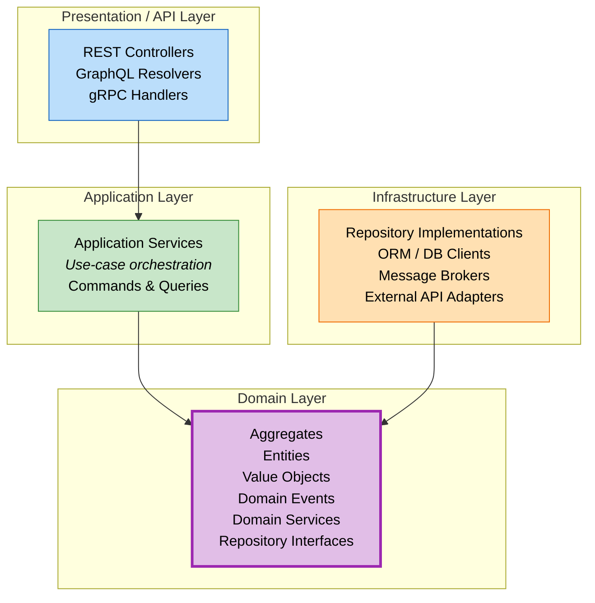

> **Dependency Rule:** All arrows point _toward_ the Domain Layer. Infrastructure _implements_ domain interfaces (Dependency Inversion). The domain layer has **zero** dependencies on frameworks, databases, or HTTP.

---

