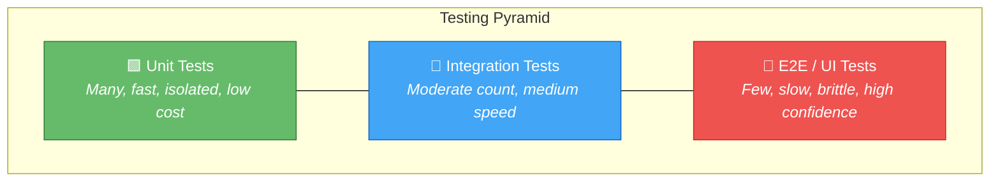
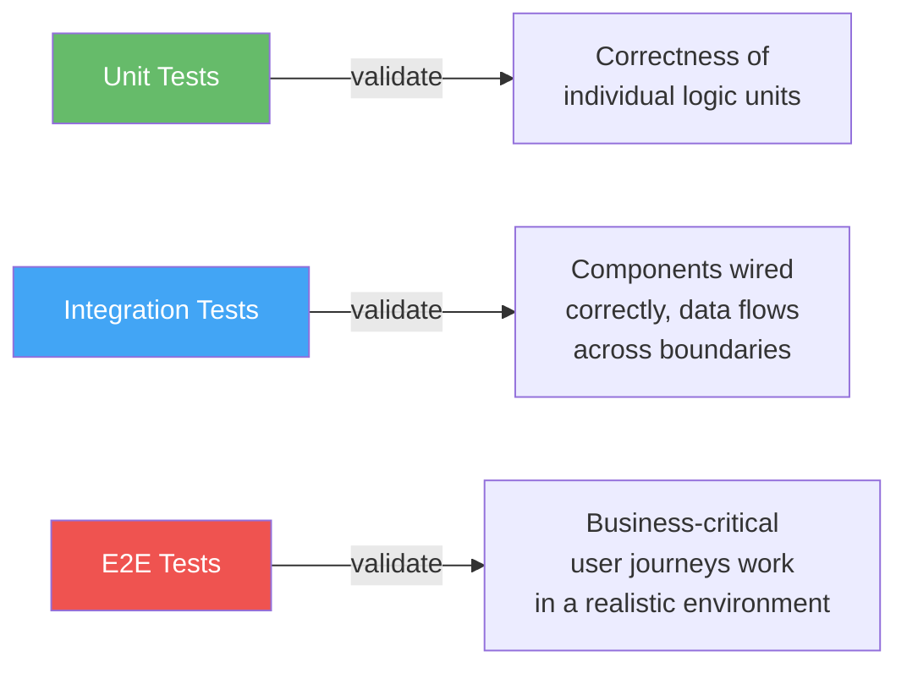
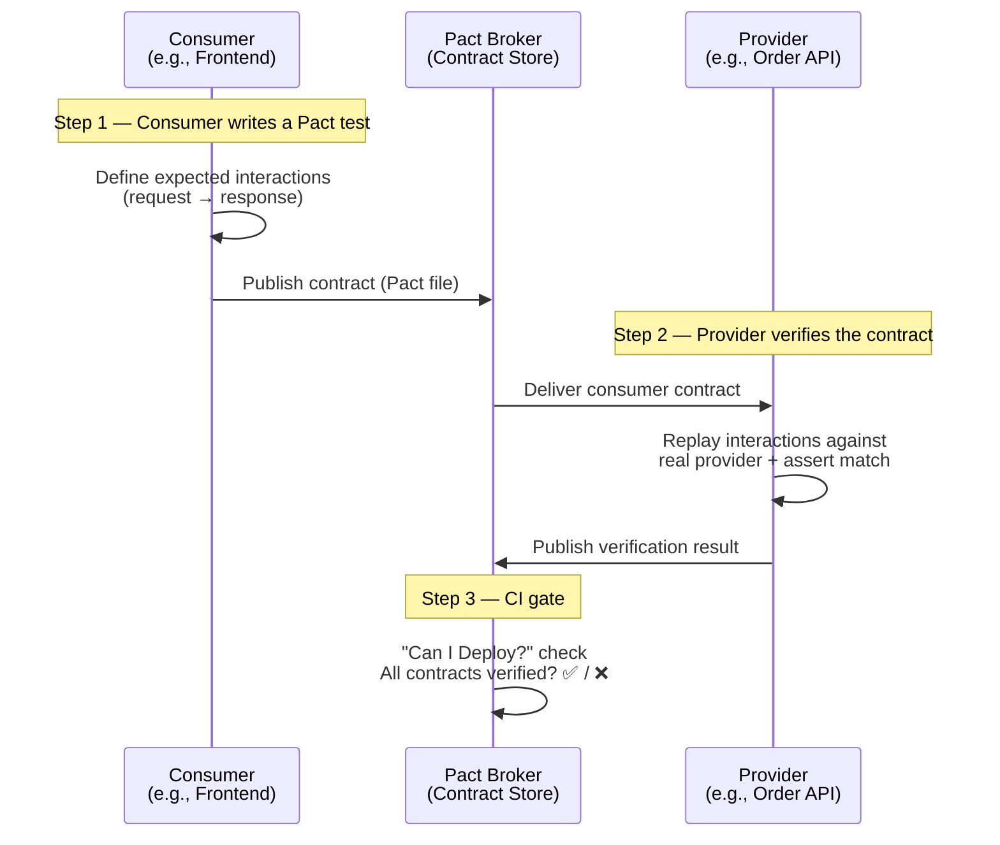
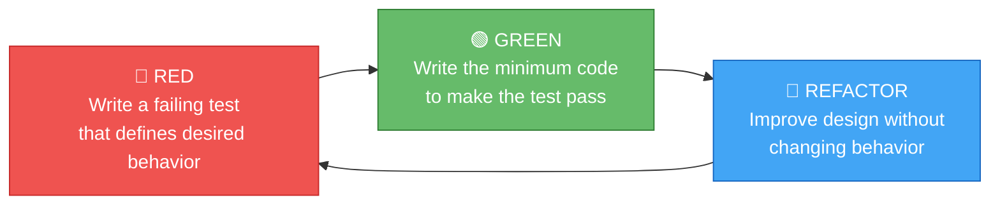
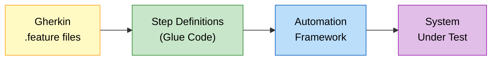

# Part II — Testing Philosophy

## Table of Contents

- [1.1 The Testing Pyramid](#11-the-testing-pyramid)
  - [Layer Characteristics](#layer-characteristics)
  - [What Each Layer Validates](#what-each-layer-validates)
- [1.2 Contract Testing](#12-contract-testing)
- [1.3 Test-Driven Development (TDD)](#13-test-driven-development-tdd)
  - [The Red-Green-Refactor Cycle](#the-red-green-refactor-cycle)
  - [TDD Rules (Robert C. Martin — "Uncle Bob")](#tdd-rules-robert-c-martin-uncle-bob)
  - [TDD Example — Building a `RomanNumeral` Converter Step-by-Step](#tdd-example-building-a-romannumeral-converter-step-by-step)
  - [When TDD Shines vs. When to Adapt](#when-tdd-shines-vs-when-to-adapt)
- [1.4 Behavior-Driven Development (BDD)](#14-behavior-driven-development-bdd)
  - [Gherkin Example](#gherkin-example)
  - [BDD Toolchain Flow](#bdd-toolchain-flow)
  - [TDD vs. BDD Comparison](#tdd-vs-bdd-comparison)


## 1.1 The Testing Pyramid



### Layer Characteristics

| Layer | Scope | Speed | # of Tests | Dependency Strategy | Example Tools |
|-------|-------|-------|-----------|-------------------|---------------|
| **Unit** | Single function / class | Milliseconds | Thousands | All dependencies mocked/stubbed | JUnit, pytest, Jest, xUnit |
| **Integration** | Multiple components, real I/O | Seconds | Hundreds | Real DB (Testcontainers), real filesystem, stubbed externals | Testcontainers, WireMock, Spring Boot Test |
| **End-to-End (E2E)** | Full system from user perspective | Minutes | Tens | Full environment (staging or docker-compose) | Cypress, Playwright, Selenium, Postman/Newman |

### What Each Layer Validates



> **Anti-pattern — Ice Cream Cone:** Heavy E2E, few unit tests. Result: slow CI pipelines, flaky builds, hours to identify root cause. Fix: invert the ratio.

---

## 1.2 Contract Testing

Contract testing verifies that the **API contract** between a consumer and a provider remains compatible, without requiring both services to run simultaneously.



**Pact Workflow Summary:**

| Step | Actor | Action |
|------|-------|--------|
| 1 | Consumer | Writes tests expressing expected API behavior → generates a _Pact file_ (JSON contract). |
| 2 | Consumer CI | Publishes Pact file to a **Pact Broker**. |
| 3 | Provider CI | Pulls the Pact file, replays requests against its real codebase, asserts responses match. |
| 4 | Deployment gate | `can-i-deploy` CLI checks the broker: all consumer contracts verified → green light. |

**Why contract testing matters at principal level:**
- Eliminates the need for expensive shared staging environments.
- Enables **independent deployability** of microservices.
- Catches breaking API changes _before_ they hit production.

---

## 1.3 Test-Driven Development (TDD)

### The Red-Green-Refactor Cycle



### TDD Rules (Robert C. Martin — "Uncle Bob")

1. **You may not write production code** except to make a failing test pass.
2. **You may not write more of a test** than is sufficient to fail (compilation failures count).
3. **You may not write more production code** than is sufficient to pass the currently failing test.

### TDD Example — Building a `RomanNumeral` Converter Step-by-Step

| Cycle | Test (RED) | Code (GREEN) | Refactor |
|-------|-----------|-------------|----------|
| 1 | `assert to_roman(1) == "I"` | `return "I"` | — |
| 2 | `assert to_roman(2) == "II"` | `return "I" * number` | — |
| 3 | `assert to_roman(4) == "IV"` | Add special-case lookup | Extract lookup table |
| 4 | `assert to_roman(9) == "IX"` | Extend lookup table | Generalize algorithm |

> **Principal-level nuance:** TDD is a _design_ tool, not just a testing tool. It forces you to think about the **interface** before the implementation, producing naturally modular, low-coupling code.

### When TDD Shines vs. When to Adapt

| TDD Shines | Adapt / Spike First |
|-----------|-------------------|
| Well-understood domain logic | Exploratory prototyping, UI layout experiments |
| Algorithm-heavy code | Infrastructure wiring (test with integration tests instead) |
| API contract design | Performance-critical hot paths (profile-driven, then lock with tests) |

---

## 1.4 Behavior-Driven Development (BDD)

BDD extends TDD by expressing tests in **business-readable language** using the **Given-When-Then** format (Gherkin syntax).

### Gherkin Example

```gherkin
Feature: Shopping Cart Checkout
  As a logged-in customer
  I want to check out my cart
  So that I receive my products

  Scenario: Successful checkout with valid payment
    Given the cart contains 2 items totalling $50.00
    And the customer has a valid credit card on file
    When the customer clicks "Place Order"
    Then an order confirmation is displayed
    And the order status is "Placed"
    And an inventory reservation is created for each item

  Scenario: Checkout fails with expired card
    Given the cart contains 1 item totalling $25.00
    And the customer's credit card is expired
    When the customer clicks "Place Order"
    Then an error message "Payment declined" is displayed
    And no order is created
```

### BDD Toolchain Flow



| Language | BDD Framework | Notes |
|----------|--------------|-------|
| Java/Kotlin | Cucumber-JVM | Most mature; integrates with JUnit |
| Python | Behave, pytest-bdd | pytest-bdd is lighter-weight |
| JavaScript | Cucumber.js | Works with Playwright/Cypress for E2E |
| .NET | SpecFlow | Gherkin-based, NUnit/xUnit integration |

### TDD vs. BDD Comparison

| Dimension | TDD | BDD |
|-----------|-----|-----|
| **Audience** | Developers | Developers + Product + QA |
| **Language** | Code (test framework assertions) | Natural language (Gherkin) |
| **Focus** | Correctness of implementation | Correctness of _behavior_ from user perspective |
| **Granularity** | Unit / class level | Feature / scenario level |
| **Artifacts** | Test suites | Living documentation (executable specs) |

> **They are complementary, not competing.** Use BDD for feature-level acceptance criteria and TDD for internal design of the code that implements those features.

---

