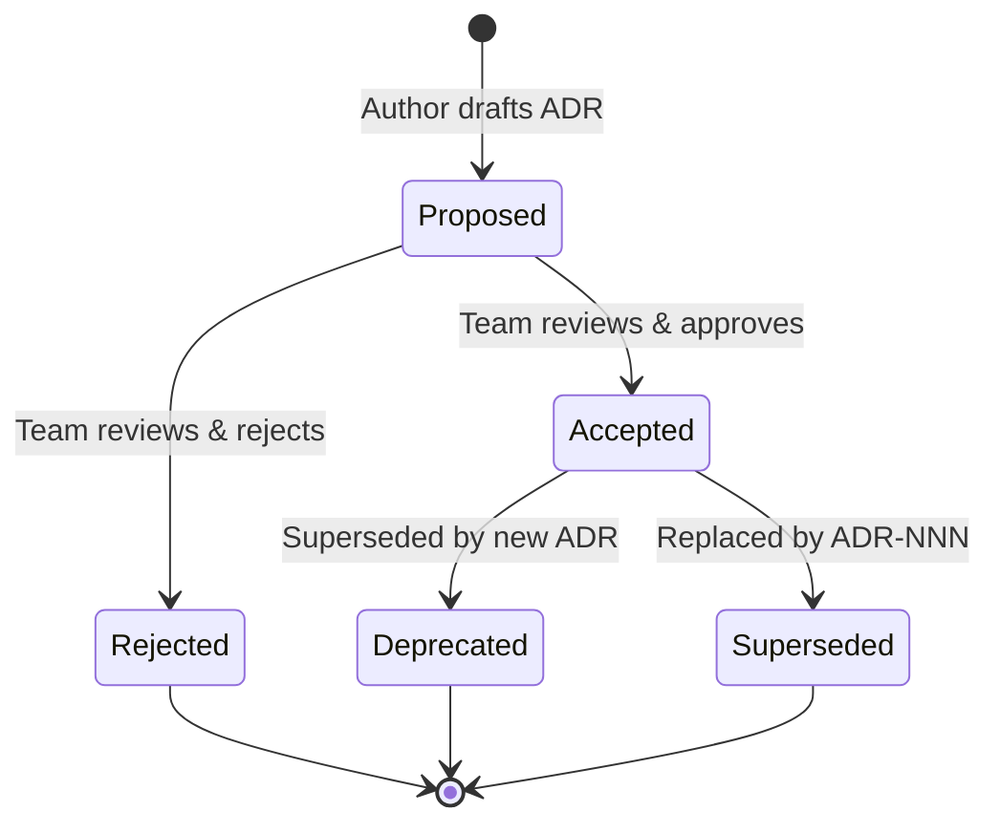
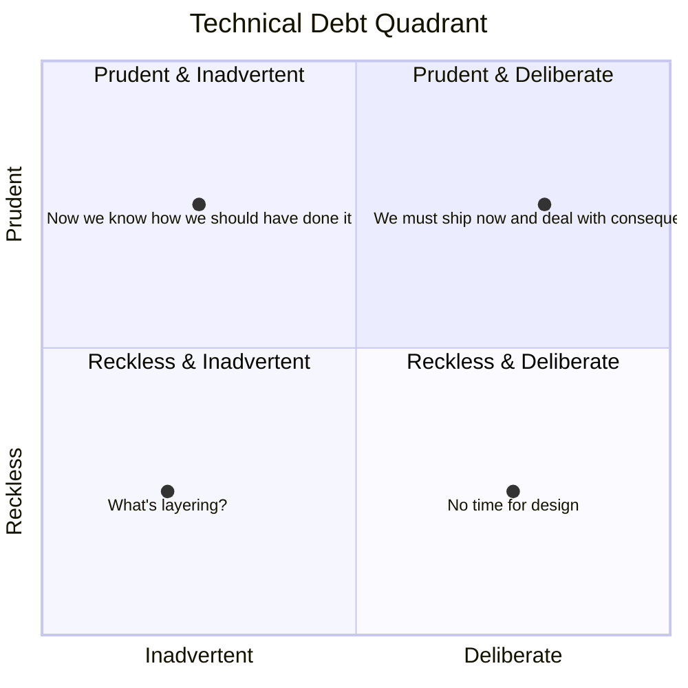
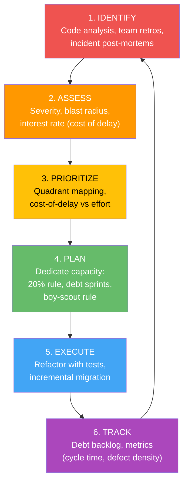
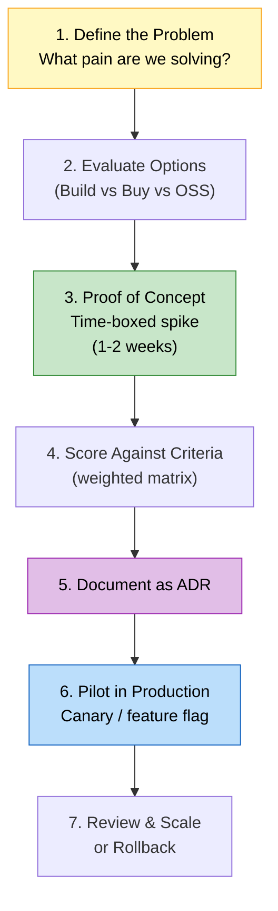
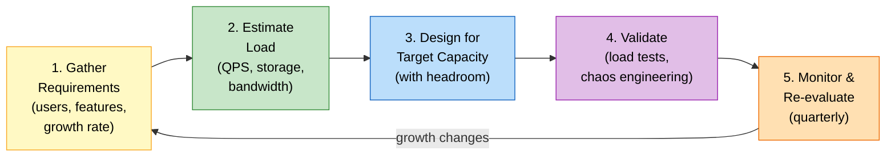

# Part III — Technical Strategy & Leadership

## Table of Contents

- [1.1 Architectural Decision Records (ADRs)](#11-architectural-decision-records-adrs)
  - [ADR Lifecycle](#adr-lifecycle)
  - [ADR Template (Michael Nygard Format)](#adr-template-michael-nygard-format)
- [Status](#status)
- [Context](#context)
- [Decision](#decision)
- [Consequences](#consequences)
  - [Positive](#positive)
  - [Negative](#negative)
  - [Risks](#risks)
- [Alternatives Considered](#alternatives-considered)
- [Related](#related)
  - [ADR Best Practices](#adr-best-practices)
- [1.2 Managing & Reducing Technical Debt](#12-managing-and-reducing-technical-debt)
  - [What Is Technical Debt?](#what-is-technical-debt)
  - [Technical Debt Quadrant (Martin Fowler)](#technical-debt-quadrant-martin-fowler)
  - [Technical Debt Management Framework](#technical-debt-management-framework)
  - [Practical Debt-Reduction Tactics](#practical-debt-reduction-tactics)
  - [Communicating Debt to Non-Technical Stakeholders](#communicating-debt-to-non-technical-stakeholders)
- [1.3 Cost-vs-Benefit Evaluation for Technology Adoption](#13-cost-vs-benefit-evaluation-for-technology-adoption)
  - [Decision Framework](#decision-framework)
  - [Weighted Scoring Matrix](#weighted-scoring-matrix)
  - [Total Cost of Ownership (TCO) Checklist](#total-cost-of-ownership-tco-checklist)
- [1.4 System Capacity Planning & Estimation](#14-system-capacity-planning-and-estimation)
  - [The Capacity Planning Process](#the-capacity-planning-process)
  - [1.4.1 QPS (Queries Per Second) Estimation](#141-qps-queries-per-second-estimation)
  - [1.4.2 Storage Estimation](#142-storage-estimation)
  - [1.4.3 Bandwidth Estimation](#143-bandwidth-estimation)
  - [Quick-Reference: Useful Numbers Every Principal Should Know](#quick-reference-useful-numbers-every-principal-should-know)
  - [Capacity Planning Worksheet Template](#capacity-planning-worksheet-template)


## 1.1 Architectural Decision Records (ADRs)

An ADR captures a **single, significant architectural decision** along with its context and consequences. They form the project's institutional memory.

### ADR Lifecycle



### ADR Template (Michael Nygard Format)

```markdown
# ADR-0042: Use PostgreSQL for the Order Service

## Status
Accepted (2025-01-15)

## Context
The Order Service requires ACID transactions for financial data,
complex queries for reporting, and mature tooling. The team has
deep PostgreSQL expertise. DynamoDB was considered for its
operational simplicity but lacks native support for ad-hoc
analytical queries without exporting to another store.

## Decision
We will use PostgreSQL (AWS RDS, Multi-AZ) as the primary
data store for the Order Service.

## Consequences
### Positive
- Strong transactional guarantees.
- Rich query language; avoids need for a separate analytics DB.
- Team familiarity reduces ramp-up time.

### Negative
- Requires vertical scaling for write-heavy spikes (mitigated by
  read replicas and connection pooling via PgBouncer).
- Schema migrations require careful coordination (mitigated by
  using Flyway with CI validation).

### Risks
- If write volume exceeds 50K TPS, we may need to shard or
  revisit DynamoDB for specific write-heavy aggregates.

## Alternatives Considered
| Option | Pros | Cons | Verdict |
|--------|------|------|---------|
| DynamoDB | Fully managed, auto-scaling | No joins, learning curve, analytics gap | Rejected |
| CockroachDB | Distributed SQL | Immature ecosystem, higher cost | Deferred |

## Related
- ADR-0038: Microservice decomposition strategy
- ADR-0040: Event-driven architecture for inter-service communication
```

### ADR Best Practices

| Practice | Rationale |
|----------|-----------|
| Store ADRs **in the repo** (`docs/adr/`) | They travel with the code; version-controlled. |
| Number sequentially (`ADR-0001`, `ADR-0002`, …) | Easy to reference in PRs and discussions. |
| Keep them **immutable** once accepted | Don't edit old ADRs; write a new one that supersedes. |
| Include the "why" heavily | The _decision_ is obvious in hindsight; the _reasoning_ is what newcomers need. |
| Lightweight tooling | Use [`adr-tools`](https://github.com/npryce/adr-tools) or [`log4brains`](https://github.com/thomvaill/log4brains) for scaffolding. |

---

## 1.2 Managing & Reducing Technical Debt

### What Is Technical Debt?

Technical debt is the **implied cost of future rework** caused by choosing an expedient solution now instead of a better approach that would take longer.

### Technical Debt Quadrant (Martin Fowler)



| Quadrant | Example | Response |
|----------|---------|----------|
| **Prudent + Deliberate** | "We'll use a simple in-memory cache now; we know we'll need Redis later." | Acceptable — track it, schedule paydown. |
| **Prudent + Inadvertent** | "Now that we've built it, we realize a better design exists." | Natural learning — refactor when touching the code. |
| **Reckless + Deliberate** | "We don't have time for tests." | Dangerous — creates compounding interest. Requires cultural change. |
| **Reckless + Inadvertent** | "We didn't know about SOLID principles." | Invest in education, pairing, and code review. |

### Technical Debt Management Framework



### Practical Debt-Reduction Tactics

| Tactic | Description |
|--------|-------------|
| **Boy Scout Rule** | "Leave the code cleaner than you found it." Every PR improves one small thing. |
| **20% Capacity Allocation** | Reserve 20% of each sprint for debt paydown and infrastructure improvements. |
| **Strangler Fig Pattern** | Gradually replace legacy components by routing new traffic to new implementations. |
| **Golden Path / Paved Road** | Provide well-supported templates, libraries, and patterns so teams avoid _creating_ new debt. |
| **Tech Debt Backlog** | Maintain a visible, prioritized backlog of debt items alongside feature work. |
| **Automated Quality Gates** | CI checks for test coverage thresholds, linting, dependency vulnerabilities, complexity metrics. |

### Communicating Debt to Non-Technical Stakeholders

Use financial metaphors:

| Financial Term | Tech Debt Analogy |
|---------------|-------------------|
| **Principal** | The original shortcut taken. |
| **Interest** | The ongoing cost: slower development, more bugs, higher onboarding time. |
| **Bankruptcy** | System is so fragile that even small changes risk outages — rewrite becomes unavoidable. |
| **Refinancing** | Strategic refactoring to reduce interest while preserving principal. |

---

## 1.3 Cost-vs-Benefit Evaluation for Technology Adoption

### Decision Framework



### Weighted Scoring Matrix

| Criterion | Weight | Option A (Kafka) | Option B (SQS+SNS) | Option C (RabbitMQ) |
|-----------|--------|-----------------|--------------------|--------------------|
| **Throughput at scale** | 25% | 9 (2.25) | 7 (1.75) | 6 (1.50) |
| **Operational complexity** | 20% | 4 (0.80) | 9 (1.80) | 6 (1.20) |
| **Team expertise** | 20% | 7 (1.40) | 8 (1.60) | 5 (1.00) |
| **Cost (3-year TCO)** | 15% | 5 (0.75) | 8 (1.20) | 7 (1.05) |
| **Ecosystem & tooling** | 10% | 9 (0.90) | 7 (0.70) | 7 (0.70) |
| **Vendor lock-in risk** | 10% | 8 (0.80) | 4 (0.40) | 8 (0.80) |
| **TOTAL** | 100% | **6.90** | **7.45** | **6.25** |

> In this hypothetical scenario, SQS+SNS wins on **operational simplicity** and **cost** despite Kafka's raw throughput advantage. The Principal Engineer's job is to facilitate this analysis transparently, not champion a pet technology.

### Total Cost of Ownership (TCO) Checklist

| Cost Category | Items to Include |
|--------------|-----------------|
| **Licensing / Subscription** | Per-node, per-message, per-GB pricing. |
| **Infrastructure** | Compute, storage, networking, managed service fees. |
| **People** | Training, hiring specialists, on-call burden. |
| **Migration** | Data migration, dual-running period, rollback plan. |
| **Opportunity cost** | What else could the team build with this time? |
| **Risk** | Vendor viability, community health, security track record. |

---

## 1.4 System Capacity Planning & Estimation

### The Capacity Planning Process



---

### 1.4.1 QPS (Queries Per Second) Estimation

**Scenario:** An e-commerce platform with 10M daily active users (DAU).

```
Step 1: Daily requests
  Average user makes 20 requests/day (browsing, searching, viewing products)
  Total daily requests = 10M × 20 = 200M requests/day

Step 2: Average QPS
  QPS_avg = 200M / 86,400 seconds ≈ 2,315 QPS

Step 3: Peak QPS (assume 3× average during peak hours)
  QPS_peak = 2,315 × 3 ≈ 6,945 QPS

Step 4: Design target (add 2× headroom for spikes + growth)
  QPS_design = 6,945 × 2 ≈ 14,000 QPS
```

### 1.4.2 Storage Estimation

**Scenario:** Order storage for the same platform.

```
Assumptions:
  - 500K orders/day
  - Average order size: 2 KB (JSON document)
  - Retention: 5 years
  - Indexes add ~50% overhead
  - Replication factor: 3

Daily storage:
  500K × 2 KB = 1 GB/day

Annual storage:
  1 GB × 365 = 365 GB/year

5-year raw storage:
  365 GB × 5 = 1.825 TB

With indexes:
  1.825 TB × 1.5 = 2.74 TB

With replication:
  2.74 TB × 3 = 8.21 TB

Design target (round up with 30% buffer):
  ≈ 11 TB provisioned storage
```

### 1.4.3 Bandwidth Estimation

```
Inbound (client → server):
  QPS_peak × avg_request_size = 14,000 × 0.5 KB = 7 MB/s ≈ 56 Mbps

Outbound (server → client):
  QPS_peak × avg_response_size = 14,000 × 3 KB = 42 MB/s ≈ 336 Mbps

Design target (with headroom):
  Inbound:  ≈ 100 Mbps
  Outbound: ≈ 700 Mbps (≈ 1 Gbps port)
```

### Quick-Reference: Useful Numbers Every Principal Should Know

| Metric | Approximate Value |
|--------|-------------------|
| Seconds in a day | 86,400 (~10⁵ for estimation) |
| Seconds in a month | ~2.6 × 10⁶ |
| Seconds in a year | ~3.15 × 10⁷ |
| 1 Million requests/day | ~12 QPS |
| 1 Billion requests/day | ~12,000 QPS |
| 1 KB × 1M records | 1 GB |
| 1 KB × 1B records | 1 TB |
| L1 cache reference | ~1 ns |
| L2 cache reference | ~4 ns |
| Main memory reference | ~100 ns |
| SSD random read | ~150 µs |
| HDD random read | ~10 ms |
| Network round-trip (same datacenter) | ~0.5 ms |
| Network round-trip (cross-continent) | ~150 ms |

### Capacity Planning Worksheet Template

| Dimension | Input | Formula | Result |
|-----------|-------|---------|--------|
| **DAU** | ___M | Given | |
| **Requests/user/day** | ___ | Given | |
| **Daily requests** | | DAU × req/user | ___M |
| **Avg QPS** | | daily_req / 86,400 | ___ |
| **Peak QPS** | | avg_QPS × peak_multiplier | ___ |
| **Design QPS** | | peak_QPS × headroom | ___ |
| **Record size** | | ___KB | |
| **Daily new records** | | ___K | |
| **Daily storage** | | records × size | ___GB |
| **Annual storage** | | daily × 365 | ___TB |
| **N-year storage** | | annual × N × index_overhead × replication | ___TB |
| **Inbound bandwidth** | | QPS × avg_request_size | ___Mbps |
| **Outbound bandwidth** | | QPS × avg_response_size | ___Mbps |

---

