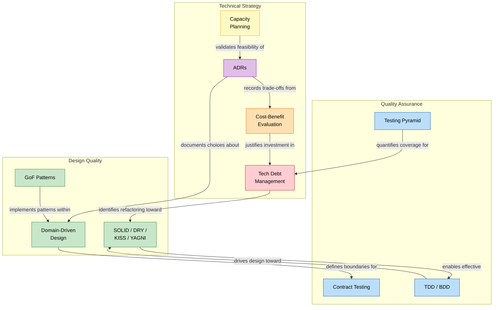

# Part IV — Pulling It All Together

## Table of Contents

  - [How These Disciplines Interconnect](#how-these-disciplines-interconnect)
  - [The Principal Engineer's Checklist](#the-principal-engineers-checklist)

### How These Disciplines Interconnect

### The Principal Engineer's Checklist

| Area | Key Question | Artifact |
|------|-------------|----------|
| **Design** | Are we using the right patterns for the right problems? | Code reviews, pattern catalogs |
| **Boundaries** | Are our bounded contexts clean and independently deployable? | Context maps, ADRs |
| **Testing** | Is our test pyramid balanced? Can we deploy with confidence? | Coverage reports, contract results |
| **Debt** | Is our debt visible, prioritized, and being actively reduced? | Tech debt backlog, trend metrics |
| **Decisions** | Are architectural choices documented and discoverable? | ADR index |
| **Capacity** | Have we estimated load and validated with real benchmarks? | Capacity worksheets, load test results |
| **Adoption** | Are we evaluating new technologies rigorously, not just by hype? | Weighted scoring matrices, POC results |

---

